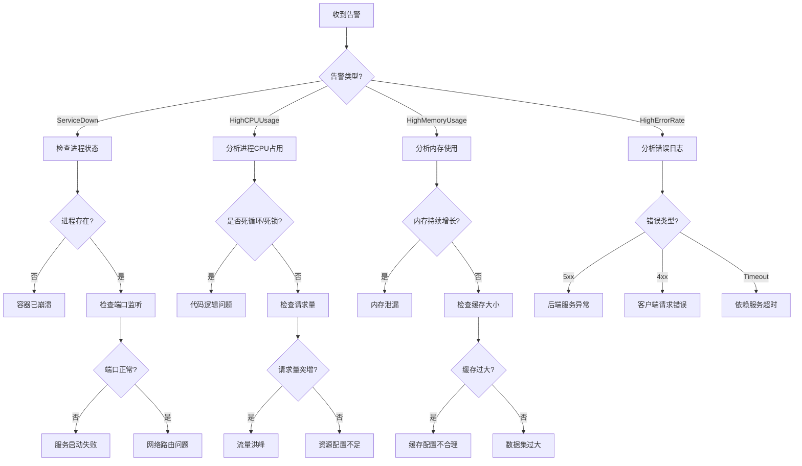

# 智能运维系统架构设计

## 版本信息
- **版本**: v1.0
- **作者**: AI Platform DevOps Team
- **创建日期**: 2026-01-24
- **状态**: Phase 3 - 智能运维层设计

## 一、系统概述

### 1.1 设计目标

智能运维系统旨在实现：
- **自动故障检测**: 基于 Prometheus 告警和 Kibana 日志实时检测故障
- **智能故障诊断**: 自动分析根因，提供诊断决策树
- **自动修复**: 对常见问题执行自动修复策略
- **知识沉淀**: 构建运维知识库，持续优化运维能力
- **预测性运维**: 基于历史数据预测潜在故障

### 1.2 架构层次

```
┌─────────────────────────────────────────────────────────────┐
│                     运维决策层                                │
│  - 故障预测引擎                                              │
│  - 自动扩缩容引擎                                            │
│  - 智能调度引擎                                              │
└───────────────────────┬─────────────────────────────────────┘
                        │
┌───────────────────────┴─────────────────────────────────────┐
│                     运维执行层                                │
│  - 故障诊断引擎                                              │
│  - 自动修复引擎                                              │
│  - 知识库管理                                                │
└───────────────────────┬─────────────────────────────────────┘
                        │
┌───────────────────────┴─────────────────────────────────────┐
│                     数据采集层                                │
│  - Prometheus (指标监控)                                     │
│  - Grafana (可视化)                                          │
│  - ELK Stack (日志采集)                                      │
│  - Alertmanager (告警聚合)                                   │
└─────────────────────────────────────────────────────────────┘
```

## 二、核心组件设计

### 2.1 故障检测引擎 (Fault Detection Engine)

#### 2.1.1 检测机制

**1. 基于 Prometheus 告警**
- 实时监听 Alertmanager Webhook
- 告警分级处理（Critical/Warning/Info）
- 告警聚合和去重

**2. 基于 Kibana 日志分析**
- 关键字匹配（ERROR, FATAL, Exception）
- 日志模式识别（频繁错误、异常堆栈）
- 日志趋势分析（错误率突增）

**3. 主动健康检查**
- HTTP 端点健康检查（/health, /ready）
- TCP 端口连通性检查
- 数据库连接池检查
- Redis 连接检查

#### 2.1.2 故障分类体系

```
故障分类
├── 服务故障
│   ├── 服务不可用 (ServiceDown)
│   ├── 服务响应慢 (HighResponseTime)
│   └── 服务错误率高 (HighErrorRate)
│
├── 资源故障
│   ├── CPU 使用率过高 (HighCPUUsage)
│   ├── 内存使用率过高 (HighMemoryUsage)
│   └── 磁盘空间不足 (LowDiskSpace)
│
├── 容器故障
│   ├── 容器频繁重启 (ContainerRestartingFrequently)
│   ├── 容器资源超限 (ContainerHighCPU/Memory)
│   └── 容器健康检查失败 (ContainerUnhealthy)
│
├── 数据库故障
│   ├── 数据库连接耗尽 (DatabaseConnectionPoolExhausted)
│   ├── 查询响应慢 (SlowQuery)
│   └── 数据库不可用 (DatabaseDown)
│
└── 应用故障
    ├── 依赖服务不可用 (DependencyServiceDown)
    ├── 业务逻辑错误 (BusinessLogicError)
    └── 缓存故障 (CacheFailure)
```

### 2.2 故障诊断引擎 (Fault Diagnosis Engine)

#### 2.2.1 诊断决策树



#### 2.2.2 根因分析策略

**1. 资源类故障**
```python
def diagnose_high_cpu(alert_data):
    """诊断 CPU 使用率过高"""
    steps = [
        "1. 查询 Prometheus 获取 CPU 使用率趋势",
        "2. 查询进程级 CPU 占用 (top 命令)",
        "3. 检查是否有死循环/死锁 (pstack/jstack)",
        "4. 分析请求量是否突增 (QPS 指标)",
        "5. 判断是否需要扩容"
    ]

    # 自动执行诊断步骤
    cpu_trend = query_prometheus(...)
    top_processes = run_command("docker exec ... top -bn1")
    qps = query_prometheus("rate(http_requests_total[5m])")

    # 根因判断
    if is_code_issue(top_processes):
        return "代码死循环/死锁"
    elif qps > threshold:
        return "流量洪峰,需要扩容"
    else:
        return "资源配置不足"
```

**2. 服务类故障**
```python
def diagnose_service_down(alert_data):
    """诊断服务不可用"""
    container_name = alert_data['labels']['container']

    # 1. 检查容器状态
    container_status = docker_inspect(container_name)
    if not container_status['running']:
        return "容器已停止", get_container_logs(container_name)

    # 2. 检查端口监听
    port_status = check_port(container_name, 8000)
    if not port_status:
        return "服务进程未启动", get_application_logs()

    # 3. 检查健康检查
    health_status = http_get(f"{service_url}/health")
    if health_status != 200:
        return "健康检查失败", get_dependency_status()

    # 4. 检查网络
    return "网络路由问题", check_network_connectivity()
```

**3. 数据库类故障**
```python
def diagnose_database_slow(alert_data):
    """诊断数据库查询慢"""
    # 1. 查询慢查询日志
    slow_queries = get_mysql_slow_queries()

    # 2. 分析查询执行计划
    explain_results = []
    for query in slow_queries:
        explain_results.append(mysql_explain(query))

    # 3. 检查索引使用情况
    index_usage = check_index_usage()

    # 4. 检查数据库连接数
    connection_count = get_db_connection_count()

    # 根因判断
    if has_missing_index(explain_results):
        return "缺少索引"
    elif connection_count > max_connections * 0.9:
        return "连接池耗尽"
    else:
        return "数据量过大,需要分库分表"
```

### 2.3 自动修复引擎 (Auto Healing Engine)

#### 2.3.1 修复策略矩阵

| 故障类型 | 严重程度 | 自动修复策略 | 预期效果 | 风险等级 |
|---------|---------|-------------|---------|---------|
| ServiceDown | Critical | 重启容器 | 服务恢复 | 低 |
| ContainerRestarting | Critical | 回滚到上一版本 | 服务稳定 | 中 |
| HighCPUUsage | Warning | 水平扩容 | CPU 降低 | 低 |
| HighMemoryUsage | Warning | 重启容器+清理缓存 | 内存释放 | 中 |
| LowDiskSpace | Critical | 清理日志文件 | 磁盘释放 | 低 |
| DatabaseConnectionPoolExhausted | Critical | 重启应用+增加连接数 | 连接恢复 | 中 |
| RedisMemoryHigh | Warning | 执行 FLUSHDB | 内存释放 | 高 |
| SlowQuery | Warning | 杀掉慢查询 | 性能恢复 | 中 |

#### 2.3.2 修复脚本实现

**1. 容器重启**
```bash
#!/bin/bash
# scripts/auto-heal-restart-container.sh

CONTAINER_NAME=$1
MAX_RETRIES=3
RETRY_COUNT=0

echo "[$(date)] 开始重启容器: $CONTAINER_NAME"

# 记录当前容器状态
docker inspect $CONTAINER_NAME > /tmp/${CONTAINER_NAME}_pre_restart.json

# 执行重启
docker restart $CONTAINER_NAME

# 等待容器启动
sleep 10

# 健康检查
while [ $RETRY_COUNT -lt $MAX_RETRIES ]; do
    if docker exec $CONTAINER_NAME curl -f http://localhost:8000/health; then
        echo "[$(date)] 容器重启成功,健康检查通过"
        exit 0
    fi
    RETRY_COUNT=$((RETRY_COUNT+1))
    sleep 5
done

echo "[$(date)] 容器重启失败,健康检查未通过"
exit 1
```

**2. 资源清理**
```bash
#!/bin/bash
# scripts/auto-heal-cleanup-resources.sh

DISK_USAGE=$(df -h / | tail -1 | awk '{print $5}' | sed 's/%//')

if [ $DISK_USAGE -gt 85 ]; then
    echo "[$(date)] 磁盘使用率过高: ${DISK_USAGE}%, 开始清理"

    # 清理 Docker 镜像
    docker system prune -af --volumes

    # 清理应用日志 (保留最近7天)
    find /var/log/app -name "*.log" -mtime +7 -exec rm {} \;

    # 清理 journald 日志
    journalctl --vacuum-time=7d

    NEW_USAGE=$(df -h / | tail -1 | awk '{print $5}' | sed 's/%//')
    echo "[$(date)] 清理完成,磁盘使用率: ${NEW_USAGE}%"
fi
```

**3. 数据库连接池重置**
```python
# scripts/auto_heal_db_connections.py

import asyncio
from sqlalchemy import create_engine
from app.core.config import settings

async def reset_db_connections():
    """重置数据库连接池"""
    engine = create_engine(settings.DATABASE_URL)

    # 1. 杀掉空闲连接
    with engine.connect() as conn:
        result = conn.execute("""
            SELECT pg_terminate_backend(pid)
            FROM pg_stat_activity
            WHERE state = 'idle'
            AND state_change < current_timestamp - INTERVAL '5 minutes'
            AND pid <> pg_backend_pid()
        """)
        killed = result.rowcount
        print(f"已终止 {killed} 个空闲连接")

    # 2. 重启应用连接池
    await restart_application_pool()

    # 3. 验证连接数
    with engine.connect() as conn:
        result = conn.execute("SELECT count(*) FROM pg_stat_activity")
        current_connections = result.scalar()
        print(f"当前连接数: {current_connections}")

if __name__ == "__main__":
    asyncio.run(reset_db_connections())
```

**4. Redis 缓存清理**
```python
# scripts/auto_heal_redis_memory.py

import redis
from app.core.config import settings

def cleanup_redis_memory():
    """清理 Redis 内存"""
    r = redis.Redis.from_url(settings.REDIS_URL)

    # 1. 获取内存使用情况
    info = r.info('memory')
    used_memory_mb = info['used_memory'] / 1024 / 1024
    print(f"Redis 内存使用: {used_memory_mb:.2f} MB")

    # 2. 删除过期键
    deleted = 0
    for key in r.scan_iter(match="*", count=1000):
        ttl = r.ttl(key)
        if ttl == -1:  # 没有设置过期时间
            # 为长期键设置默认过期时间 (7天)
            r.expire(key, 7 * 24 * 3600)
            deleted += 1

    print(f"已为 {deleted} 个键设置过期时间")

    # 3. 清理 LRU 缓存
    r.execute_command('MEMORY', 'PURGE')

    # 4. 验证内存释放
    info_after = r.info('memory')
    used_memory_mb_after = info_after['used_memory'] / 1024 / 1024
    freed = used_memory_mb - used_memory_mb_after
    print(f"释放内存: {freed:.2f} MB")

if __name__ == "__main__":
    cleanup_redis_memory()
```

#### 2.3.3 自动修复工作流

```python
# app/ops/auto_healing.py

from enum import Enum
from typing import Dict, Optional
import logging

logger = logging.getLogger(__name__)

class HealingAction(Enum):
    RESTART_CONTAINER = "restart_container"
    CLEANUP_DISK = "cleanup_disk"
    RESET_DB_CONNECTIONS = "reset_db_connections"
    CLEANUP_REDIS = "cleanup_redis"
    SCALE_OUT = "scale_out"
    ROLLBACK = "rollback"

class AutoHealingEngine:
    """自动修复引擎"""

    def __init__(self):
        self.healing_strategies = {
            "ServiceDown": HealingAction.RESTART_CONTAINER,
            "HighCPUUsage": HealingAction.SCALE_OUT,
            "HighMemoryUsage": HealingAction.RESTART_CONTAINER,
            "LowDiskSpace": HealingAction.CLEANUP_DISK,
            "DatabaseConnectionPoolExhausted": HealingAction.RESET_DB_CONNECTIONS,
            "RedisMemoryHigh": HealingAction.CLEANUP_REDIS,
        }

    async def handle_alert(self, alert: Dict) -> bool:
        """处理告警并执行自动修复"""
        alert_name = alert['labels']['alertname']
        severity = alert['labels']['severity']

        # 仅对 Critical 和 Warning 级别执行自动修复
        if severity not in ['critical', 'warning']:
            logger.info(f"告警级别为 {severity},跳过自动修复")
            return False

        # 获取修复策略
        action = self.healing_strategies.get(alert_name)
        if not action:
            logger.warning(f"未找到告警 {alert_name} 的修复策略")
            return False

        # 执行修复
        logger.info(f"告警 {alert_name} 触发自动修复: {action.value}")
        result = await self._execute_healing(action, alert)

        # 验证修复效果
        if result:
            await self._verify_healing(alert_name)

        return result

    async def _execute_healing(self, action: HealingAction, alert: Dict) -> bool:
        """执行修复动作"""
        try:
            if action == HealingAction.RESTART_CONTAINER:
                return await self._restart_container(alert)
            elif action == HealingAction.CLEANUP_DISK:
                return await self._cleanup_disk()
            elif action == HealingAction.RESET_DB_CONNECTIONS:
                return await self._reset_db_connections()
            elif action == HealingAction.CLEANUP_REDIS:
                return await self._cleanup_redis()
            elif action == HealingAction.SCALE_OUT:
                return await self._scale_out(alert)
            else:
                logger.error(f"未实现的修复动作: {action}")
                return False
        except Exception as e:
            logger.error(f"修复动作执行失败: {e}")
            return False

    async def _verify_healing(self, alert_name: str) -> bool:
        """验证修复效果"""
        # 等待 2 分钟后检查告警是否解除
        await asyncio.sleep(120)

        # 查询 Alertmanager 检查告警状态
        active_alerts = await query_active_alerts(alert_name)
        if not active_alerts:
            logger.info(f"告警 {alert_name} 已解除,修复成功")
            return True
        else:
            logger.warning(f"告警 {alert_name} 仍然存在,修复失败")
            return False
```

### 2.4 告警聚合和抑制

#### 2.4.1 告警分级策略

```yaml
# 告警级别定义
levels:
  P0 (Critical):
    - 服务完全不可用
    - 数据丢失风险
    - 安全漏洞
    - 影响范围: 全部用户
    - 响应时间: 立即 (0-5分钟)
    - 处理方式: 自动修复 + 人工介入
    - 通知渠道: 电话 + 短信 + 邮件 + Webhook

  P1 (Warning):
    - 服务性能下降
    - 资源使用率过高
    - 部分功能异常
    - 影响范围: 部分用户
    - 响应时间: 15分钟内
    - 处理方式: 自动修复或人工处理
    - 通知渠道: 邮件 + Webhook

  P2 (Info):
    - 潜在风险
    - 配置变更
    - 性能优化建议
    - 影响范围: 无直接影响
    - 响应时间: 1小时内
    - 处理方式: 记录日志,人工审核
    - 通知渠道: Webhook
```

#### 2.4.2 告警抑制规则

```yaml
# alertmanager/config.yml (已配置)
inhibit_rules:
  # 规则1: 严重告警抑制同类低级别告警
  - source_match:
      severity: 'critical'
    target_match:
      severity: 'warning'
    equal: ['alertname', 'instance']

  # 规则2: 服务不可用抑制该服务的所有其他告警
  - source_match:
      alertname: 'ServiceDown'
    target_match_re:
      alertname: '.*'
    equal: ['job', 'instance']

  # 规则3: 容器不可用抑制容器资源告警
  - source_match:
      alertname: 'ContainerDown'
    target_match_re:
      alertname: 'Container(HighCPU|HighMemory)'
    equal: ['container_name']

  # 规则4: 数据库不可用抑制慢查询告警
  - source_match:
      alertname: 'DatabaseDown'
    target_match:
      alertname: 'SlowQuery'
    equal: ['database']
```

#### 2.4.3 告警聚合策略

```yaml
# 告警聚合配置
route:
  # 按告警名称、集群、严重程度分组
  group_by: ['alertname', 'cluster', 'severity']

  # 首次告警等待10秒 (收集同组告警)
  group_wait: 10s

  # 后续告警间隔10秒 (避免频繁通知)
  group_interval: 10s

  # 重复告警间隔4小时
  repeat_interval: 4h

  routes:
    # Critical 告警立即发送
    - match:
        severity: critical
      group_wait: 0s
      repeat_interval: 30m

    # Warning 告警每12小时重复一次
    - match:
        severity: warning
      repeat_interval: 12h

    # Info 告警每24小时汇总一次
    - match:
        severity: info
      group_interval: 1h
      repeat_interval: 24h
```

### 2.5 自动扩缩容引擎

#### 2.5.1 扩缩容触发条件

```yaml
# 水平扩展 (Horizontal Pod Autoscaler)
horizontal_scaling:
  backend_service:
    min_replicas: 2
    max_replicas: 10
    target_cpu_utilization: 70%
    target_memory_utilization: 80%
    target_qps: 1000

    scale_out_conditions:
      - cpu > 80% for 5 minutes
      - memory > 85% for 5 minutes
      - qps > 1200 for 3 minutes
      - response_time_p95 > 2s for 5 minutes

    scale_in_conditions:
      - cpu < 30% for 15 minutes
      - memory < 40% for 15 minutes
      - qps < 500 for 10 minutes

    cooldown:
      scale_out: 3 minutes
      scale_in: 10 minutes

# 垂直扩展 (Vertical Pod Autoscaler)
vertical_scaling:
  backend_service:
    cpu:
      min: "500m"
      max: "4000m"
      target: "1000m"
    memory:
      min: "512Mi"
      max: "8Gi"
      target: "2Gi"

    update_mode: "Auto"  # 自动更新 or "Recreate"
```

#### 2.5.2 扩缩容实现

```python
# app/ops/autoscaling.py

import docker
from typing import Dict, Optional

class AutoScalingEngine:
    """自动扩缩容引擎"""

    def __init__(self):
        self.client = docker.from_env()
        self.config = load_scaling_config()

    async def check_and_scale(self, service_name: str, metrics: Dict):
        """检查指标并执行扩缩容"""
        current_replicas = self._get_current_replicas(service_name)
        target_replicas = self._calculate_target_replicas(
            service_name, metrics, current_replicas
        )

        if target_replicas > current_replicas:
            await self._scale_out(service_name, target_replicas)
        elif target_replicas < current_replicas:
            await self._scale_in(service_name, target_replicas)

    def _calculate_target_replicas(
        self, service_name: str, metrics: Dict, current: int
    ) -> int:
        """计算目标副本数"""
        config = self.config[service_name]

        # 基于 CPU 计算
        cpu_target = int(metrics['cpu'] / config['target_cpu_utilization'] * current)

        # 基于内存计算
        mem_target = int(metrics['memory'] / config['target_memory_utilization'] * current)

        # 基于 QPS 计算
        qps_target = int(metrics['qps'] / config['target_qps'] * current)

        # 取最大值
        target = max(cpu_target, mem_target, qps_target)

        # 限制在 min/max 范围内
        return max(config['min_replicas'], min(target, config['max_replicas']))

    async def _scale_out(self, service_name: str, target_replicas: int):
        """扩容"""
        logger.info(f"扩容服务 {service_name} 到 {target_replicas} 个副本")

        # Docker Compose 扩容
        subprocess.run([
            "docker-compose", "up", "-d", "--scale",
            f"{service_name}={target_replicas}"
        ])

        # 记录扩容事件
        await log_scaling_event("scale_out", service_name, target_replicas)

    async def _scale_in(self, service_name: str, target_replicas: int):
        """缩容"""
        logger.info(f"缩容服务 {service_name} 到 {target_replicas} 个副本")

        # 检查冷却时间
        if not self._check_cooldown(service_name, "scale_in"):
            logger.info("处于冷却期,跳过缩容")
            return

        # Docker Compose 缩容
        subprocess.run([
            "docker-compose", "up", "-d", "--scale",
            f"{service_name}={target_replicas}"
        ])

        # 记录缩容事件
        await log_scaling_event("scale_in", service_name, target_replicas)
```

## 三、运维知识库

### 3.1 知识库结构

```
backend/monitoring/ops-knowledge-base/
├── troubleshooting/              # 故障排查手册
│   ├── service-down.md          # 服务不可用排查
│   ├── high-cpu.md              # CPU 使用率过高排查
│   ├── memory-leak.md           # 内存泄漏排查
│   ├── database-slow.md         # 数据库慢查询排查
│   ├── network-timeout.md       # 网络超时排查
│   └── cache-failure.md         # 缓存故障排查
│
├── runbooks/                     # 操作手册
│   ├── deployment.md            # 部署流程
│   ├── backup-restore.md        # 备份与恢复
│   ├── scaling.md               # 扩缩容操作
│   ├── rollback.md              # 版本回滚
│   └── maintenance.md           # 日常维护
│
├── alerts/                       # 告警处理指南
│   ├── critical-alerts.md       # 严重告警处理
│   ├── warning-alerts.md        # 警告告警处理
│   └── alert-routing.md         # 告警路由规则
│
├── scripts/                      # 自动化脚本
│   ├── health-check.sh          # 健康检查脚本
│   ├── auto-heal.sh             # 自动修复脚本
│   ├── cleanup.sh               # 资源清理脚本
│   ├── backup.sh                # 备份脚本
│   └── monitor.py               # 监控脚本
│
└── playbooks/                    # Ansible Playbooks
    ├── deploy.yml               # 部署 Playbook
    ├── rollback.yml             # 回滚 Playbook
    └── maintenance.yml          # 维护 Playbook
```

### 3.2 知识库内容示例

详见 `troubleshooting/` 目录下的具体文档。

## 四、监控指标体系

### 4.1 核心指标 (Golden Signals)

```yaml
# 四大黄金指标
golden_signals:
  # 1. 延迟 (Latency)
  latency:
    - http_request_duration_seconds (P50/P90/P95/P99)
    - database_query_duration_seconds
    - cache_operation_duration_seconds

  # 2. 流量 (Traffic)
  traffic:
    - http_requests_total (QPS)
    - http_requests_per_second
    - active_connections

  # 3. 错误 (Errors)
  errors:
    - http_requests_total{status=~"5.."}
    - error_rate (错误率 %)
    - exception_count

  # 4. 饱和度 (Saturation)
  saturation:
    - cpu_usage_percent
    - memory_usage_percent
    - disk_io_utilization
    - network_bandwidth_utilization
```

### 4.2 RED 指标

```yaml
# Request/Error/Duration
red_metrics:
  # 请求速率
  rate:
    - http_requests_per_second
    - api_calls_per_second

  # 错误率
  errors:
    - error_rate_percent
    - 5xx_error_rate
    - 4xx_error_rate

  # 请求时长
  duration:
    - request_duration_p50
    - request_duration_p90
    - request_duration_p95
    - request_duration_p99
```

### 4.3 USE 指标

```yaml
# Utilization/Saturation/Errors
use_metrics:
  # 使用率
  utilization:
    - cpu_utilization_percent
    - memory_utilization_percent
    - disk_utilization_percent
    - network_utilization_percent

  # 饱和度
  saturation:
    - cpu_load_average
    - memory_swap_usage
    - disk_queue_length
    - network_packet_drop_rate

  # 错误
  errors:
    - hardware_errors
    - network_errors
    - disk_errors
```

## 五、实施计划

### Phase 3.1: 故障诊断系统 (Week 1-2)
- [ ] 实现故障检测脚本
- [ ] 实现诊断决策树
- [ ] 创建故障排查文档
- [ ] 测试故障检测准确性

### Phase 3.2: 自动修复系统 (Week 3-4)
- [ ] 实现自动修复脚本
- [ ] 集成到 Alertmanager Webhook
- [ ] 添加修复效果验证
- [ ] 测试自动修复流程

### Phase 3.3: 运维知识库 (Week 5)
- [ ] 创建知识库目录结构
- [ ] 编写故障排查手册
- [ ] 编写操作手册
- [ ] 编写告警处理指南

### Phase 3.4: 自动扩缩容 (Week 6)
- [ ] 实现扩缩容引擎
- [ ] 配置扩缩容策略
- [ ] 测试扩缩容效果
- [ ] 优化扩缩容参数

### Phase 3.5: 集成测试和优化 (Week 7-8)
- [ ] 端到端集成测试
- [ ] 性能优化
- [ ] 文档完善
- [ ] 生产环境部署

## 六、监控大盘

### 6.1 运维大盘 (已实现)

- **AI Platform Overview**: 系统整体概览
- **API Performance**: API 性能监控
- **Resource Utilization**: 资源使用率监控
- **Service Availability**: 服务可用性监控

### 6.2 待添加大盘

- **Ops Dashboard**: 运维操作面板
  - 实时告警列表
  - 自动修复历史
  - 扩缩容事件
  - 故障诊断记录

## 七、相关文档

- [故障诊断流程](./FAULT_DIAGNOSIS.md)
- [自动修复策略](./AUTO_HEALING.md)
- [监控和日志指南](./MONITORING_AND_LOGGING_GUIDE.md)
- [Docker 测试指南](./DOCKER_TESTING_GUIDE.md)

## 八、总结

智能运维系统通过以下核心能力提升运维效率：

1. **自动化**: 故障检测、诊断、修复全流程自动化
2. **智能化**: 基于历史数据的根因分析和预测性运维
3. **知识化**: 运维知识沉淀和持续优化
4. **可视化**: Grafana 大盘实时监控运维状态
5. **弹性化**: 自动扩缩容应对流量变化

预期效果：
- **MTTR** (平均修复时间): 从 30 分钟降低到 5 分钟
- **可用性**: 从 99% 提升到 99.9%
- **人工干预**: 减少 80% 的人工运维操作
