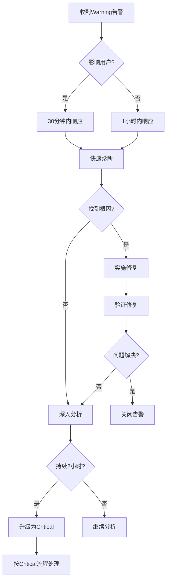

# Warning 级别告警处理指南

## 概述

**Warning告警定义**: 系统性能下降、资源使用接近阈值,但服务仍可用的告警。

**响应要求**:
- **响应时间**: 30分钟内
- **解决目标**: 工作日内解决
- **通知方式**: Slack + 邮件
- **升级机制**: 持续2小时自动升级为Critical

---

## Warning 告警列表

| 告警名称 | 描述 | 阈值 | 处理时间 | 处理文档 |
|----------|------|------|----------|----------|
| HighCPUUsage | CPU使用率过高 | >80% | 1小时 | [high-cpu.md](../troubleshooting/high-cpu.md) |
| HighMemoryUsage | 内存使用率过高 | >85% | 1小时 | [memory-leak.md](../troubleshooting/memory-leak.md) |
| HighResponseTime | 响应时间过长 | P95>2s | 30分钟 | [service-down.md](../troubleshooting/service-down.md) |
| SlowDatabaseQuery | 数据库查询慢 | >1s | 1小时 | [database-slow.md](../troubleshooting/database-slow.md) |
| HighErrorRate | 错误率过高 | >5% | 30分钟 | [high-error-rate.md](../troubleshooting/high-error-rate.md) |
| DiskSpaceWarning | 磁盘空间不足 | >80% | 4小时 | [disk-full.md](../troubleshooting/disk-full.md) |
| HighLoadAverage | 系统负载过高 | >2x CPU | 1小时 | [high-cpu.md](../troubleshooting/high-cpu.md) |
| ContainerRestarting | 容器频繁重启 | >3/小时 | 1小时 | [service-down.md](../troubleshooting/service-down.md) |

---

## HighCPUUsage 告警处理

### 告警信息
```
AlertName: HighCPUUsage
Severity: Warning
Description: CPU usage > 80% for 5 minutes
Current Value: 85%
Instance: ai-platform-backend:8000
```

### 诊断步骤

```bash
# 1. 确认CPU使用率
docker stats backend --no-stream

# 2. 查看进程CPU占用
docker exec backend top -bn1 | head -20

# 3. 检查当前QPS
curl 'http://localhost:9090/api/v1/query?query=rate(http_requests_total[1m])'

# 4. 生成性能火焰图
PID=$(docker exec backend pgrep -f uvicorn)
docker exec backend py-spy record -o /tmp/profile.svg --pid $PID --duration 30
```

### 处理方案

**短期**:
- 如果是流量突增,考虑水平扩容
- 如果是定时任务,调整执行时间

**长期**:
- 优化慢代码 (根据火焰图)
- 添加缓存
- 异步处理CPU密集任务

---

## HighMemoryUsage 告警处理

### 告警信息
```
AlertName: HighMemoryUsage
Severity: Warning
Description: Memory usage > 85% for 5 minutes
Current Value: 88%
Trend: Increasing
```

### 诊断步骤

```bash
# 1. 查看内存使用
docker stats backend --no-stream

# 2. 查看内存趋势 (是否持续增长)
curl 'http://localhost:9090/api/v1/query_range?query=container_memory_usage_bytes{container="backend"}&start='$(date -d '24 hours ago' +%s)'&end='$(date +%s)'&step=300'

# 3. 检查应用内存使用
docker exec backend python -c "
import psutil
process = psutil.Process()
print(f'Memory: {process.memory_info().rss / 1024 / 1024:.2f} MB')
"
```

### 处理方案

**如果内存稳定**:
- 正常使用,考虑增加内存限制

**如果内存持续增长**:
- 可能内存泄漏,需要详细分析
- 参考 [memory-leak.md](../troubleshooting/memory-leak.md)

---

## HighResponseTime 告警处理

### 告警信息
```
AlertName: HighResponseTime
Severity: Warning
Description: P95 response time > 2s
Current Value: 2.8s
```

### 诊断步骤

```bash
# 1. 查看慢请求
docker logs backend | grep "duration" | awk '$NF > 2000' | tail -20

# 2. 统计慢endpoint
docker logs backend | grep "duration" | awk '$NF > 2000' | awk '{print $(NF-2)}' | sort | uniq -c | sort -nr

# 3. 检查数据库查询
docker exec postgres psql -U ai_platform -c "
SELECT query, mean_exec_time FROM pg_stat_statements
ORDER BY mean_exec_time DESC LIMIT 10;
"

# 4. 检查Redis性能
docker exec redis redis-cli SLOWLOG GET 10
```

### 处理方案

- 优化慢查询 (添加索引)
- 添加缓存
- 优化算法复杂度
- 异步处理耗时操作

---

## SlowDatabaseQuery 告警处理

### 告警信息
```
AlertName: SlowDatabaseQuery
Severity: Warning
Description: Query execution time > 1s
Query: SELECT * FROM posts WHERE ...
Execution Time: 2.5s
```

### 处理步骤

```sql
-- 1. 分析查询计划
EXPLAIN ANALYZE <slow_query>;

-- 2. 检查是否缺少索引
EXPLAIN <slow_query>;
-- 如果看到 Seq Scan → 需要添加索引

-- 3. 创建索引
CREATE INDEX idx_posts_status_created ON posts(status, created_at DESC);

-- 4. 验证改进
EXPLAIN ANALYZE <slow_query>;
-- 应该看到 Index Scan
```

---

## HighErrorRate 告警处理

### 告警信息
```
AlertName: HighErrorRate
Severity: Warning
Description: Error rate > 5%
Current Value: 7.2%
Status Codes: 500, 503
```

### 诊断步骤

```bash
# 1. 查看错误日志
docker logs backend | grep -i "error\|exception" | tail -50

# 2. 统计错误类型
docker logs backend | grep -i "error" | awk '{print $5}' | sort | uniq -c | sort -nr

# 3. 检查依赖服务
docker ps
curl http://localhost:5432  # PostgreSQL
curl http://localhost:6379  # Redis
```

### 处理方案

- 修复应用Bug
- 检查依赖服务状态
- 添加错误处理和重试机制
- 优化超时配置

---

## DiskSpaceWarning 告警处理

### 告警信息
```
AlertName: DiskSpaceWarning
Severity: Warning
Description: Disk usage > 80%
Current Value: 85%
Mountpoint: /var/lib/docker
```

### 处理步骤

```bash
# 1. 查看磁盘使用
df -h

# 2. 查找大文件
du -sh /var/lib/docker/* | sort -hr | head -10

# 3. 清理Docker资源
docker system prune -a
docker volume prune

# 4. 清理日志
find /var/log -name "*.log" -mtime +30 -delete
```

---

## 告警处理工作流



---

## 告警处理最佳实践

### 1. 分优先级
- P0: 影响用户 → 立即处理
- P1: 性能下降 → 当天处理
- P2: 潜在风险 → 本周处理

### 2. 根因分析
- 不要只看表象
- 使用"5个为什么"方法
- 记录分析过程

### 3. 预防为主
- 修复后添加预防措施
- 更新监控阈值
- 优化告警规则

### 4. 知识沉淀
- 记录处理方法
- 更新知识库
- 分享给团队

---

## 相关文档

- [Critical告警处理](./critical.md)
- [Info告警处理](./info.md)
- [故障排查手册](../troubleshooting/)
