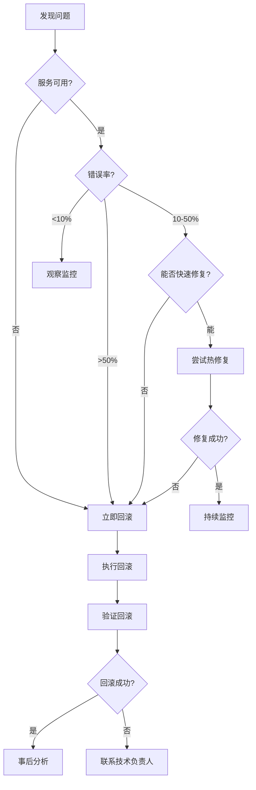

# 回滚操作手册 (Rollback Runbook)

## 概述

本手册描述了服务回滚的标准流程、决策标准、验证方法和常见问题处理。

**回滚原则**: 快速恢复服务 > 保留现场调查

---

## 何时需要回滚?

### 立即回滚场景 (Critical)

- 服务完全不可用 (ServiceDown)
- 错误率 > 50%
- 数据丢失风险
- 安全漏洞
- 性能严重下降 (P95延迟 > 5s)

### 考虑回滚场景 (Warning)

- 错误率 10-50%
- 性能下降明显 (P95延迟 2-5s)
- 新功能严重Bug
- 用户投诉增多

### 不建议回滚场景

- 错误率 < 5%
- 轻微性能波动
- 非核心功能Bug
- 可通过热修复解决

---

## 回滚决策流程



---

## 快速回滚流程

### Step 1: 停止当前版本

```bash
# 停止服务 (保留容器,便于调查)
docker-compose stop backend

# 如果需要完全清理
docker-compose down backend
```

### Step 2: 回滚镜像

**方式1: 使用备份镜像标签**

```bash
# 查看可用镜像版本
docker images | grep backend

# 回滚到上一个版本
docker tag ai-platform-backend:v1.1.0 ai-platform-backend:latest

# 或者直接指定版本
docker-compose down
# 修改 docker-compose.yml
# image: ai-platform-backend:v1.1.0
docker-compose up -d
```

**方式2: 使用Git回滚代码**

```bash
# 查看部署历史
git log --oneline --graph -10

# 回滚到上一个版本
git checkout v1.1.0

# 重新构建镜像
docker-compose build backend

# 启动服务
docker-compose up -d backend
```

### Step 3: 数据库回滚 (如果需要)

```bash
# 查看当前数据库版本
docker-compose run --rm backend alembic current

# 回滚到上一个版本
docker-compose run --rm backend alembic downgrade -1

# 或回滚到特定版本
docker-compose run --rm backend alembic downgrade <revision_id>

# 验证回滚成功
docker-compose run --rm backend alembic current
```

### Step 4: 验证回滚

```bash
# 1. 健康检查
curl -f http://localhost:8000/health

# 2. 查看版本信息
curl http://localhost:8000/api/v1/version

# 3. 查看日志
docker-compose logs -f --tail=50 backend

# 4. 查看监控指标
# - Error Rate 应该下降
# - Response Time 应该恢复正常
# - QPS 应该恢复

# 5. 执行冒烟测试
./scripts/smoke-test.sh
```

### Step 5: 观察监控 (30分钟)

```bash
# 监控关键指标
watch -n 10 'curl -s http://localhost:9090/api/v1/query?query=rate(http_errors_total[1m]) | jq .'

# 查看Grafana大盘
# - Service Availability
# - Error Rate
# - Response Time
# - QPS
```

---

## 完整回滚流程 (包含配置和数据)

### 场景: 回滚到上周的完整状态

```bash
# 1. 停止所有服务
docker-compose down

# 2. 恢复代码
git checkout v1.1.0

# 3. 恢复配置文件
cp .env.backup_20260117 .env
cp docker-compose.yml.backup_20260117 docker-compose.yml

# 4. 恢复数据库
# 删除当前数据卷
docker volume rm ai-platform_postgres_data

# 重新创建数据库
docker-compose up -d postgres
sleep 10

# 恢复备份
docker exec postgres pg_restore -U ai_platform -d ai_platform -c /backup/db_20260117.dump

# 5. 重新构建和启动
docker-compose build
docker-compose up -d

# 6. 验证
curl -f http://localhost:8000/health
./scripts/smoke-test.sh
```

---

## 分步骤回滚 (灰度回滚)

### 蓝绿部署回滚

```bash
# 当前: Green版本有问题
# 目标: 切换回Blue版本

# 1. 确认Blue版本仍在运行
docker ps | grep backend-blue

# 2. 修改负载均衡配置
# nginx.conf
upstream backend {
    server backend-blue:8000;  # 切换到Blue
    # server backend-green:8000;  # 注释掉Green
}

# 3. 重载Nginx
docker exec nginx nginx -s reload

# 4. 验证流量已切换
curl -s http://localhost/api/v1/health | jq -r '.instance_id'

# 5. 停止Green版本
docker stop backend-green
```

### 金丝雀回滚

```bash
# 当前: 10%流量在新版本,发现问题
# 目标: 逐步回滚到旧版本

# 1. 减少新版本实例比例
docker-compose up -d --scale backend-v2=1 --scale backend-v1=9

# 2. 观察5分钟
sleep 300

# 3. 完全切换回旧版本
docker-compose up -d --scale backend-v2=0 --scale backend-v1=10

# 4. 停止新版本
docker-compose stop backend-v2
```

---

## 数据库回滚注意事项

### 安全回滚 (只回滚Schema)

```bash
# 只回滚Schema,不影响数据
docker-compose run --rm backend alembic downgrade -1

# 验证数据完整性
docker exec postgres psql -U ai_platform -c "SELECT COUNT(*) FROM posts;"
```

### 危险回滚 (包含数据)

```bash
# ⚠️ 警告: 会丢失新版本产生的数据
docker exec postgres pg_restore -U ai_platform -d ai_platform -c backup_20260117.dump

# 必须先评估数据丢失影响
# 必须获得管理层批准
```

### 不可回滚的迁移

```python
# 例如: 删除列的迁移无法安全回滚
def upgrade():
    op.drop_column('posts', 'old_field')  # ⚠️ 数据永久丢失

def downgrade():
    # 无法恢复已删除的数据
    op.add_column('posts', sa.Column('old_field', sa.String(), nullable=True))
```

**解决方案**: 分步骤迁移

```python
# 第一次部署: 停止使用,但不删除
def upgrade():
    # 只是不再使用,保留列
    pass

# 第二次部署 (确认无问题后): 删除
def upgrade():
    op.drop_column('posts', 'old_field')
```

---

## 回滚验证清单

### 功能验证
- [ ] 健康检查端点正常
- [ ] 核心API正常响应
- [ ] 用户登录功能正常
- [ ] 数据读写功能正常

### 性能验证
- [ ] 响应时间恢复正常 (P95 < 500ms)
- [ ] 错误率降低 (< 1%)
- [ ] CPU/内存使用率正常
- [ ] 数据库查询正常

### 数据验证
- [ ] 数据完整性检查通过
- [ ] 关键数据未丢失
- [ ] 数据一致性正常

### 监控验证
- [ ] 无新告警触发
- [ ] Grafana大盘指标正常
- [ ] 日志无ERROR级别错误

---

## 回滚后续工作

### 1. 保留现场

```bash
# 保留失败版本的容器和日志
docker commit backend backend-failed-$(date +%Y%m%d_%H%M%S)
docker logs backend > failed-logs-$(date +%Y%m%d_%H%M%S).log

# 保留失败版本的代码
git tag deployment-failed-$(date +%Y%m%d_%H%M%S)
git push origin deployment-failed-$(date +%Y%m%d_%H%M%S)
```

### 2. 根因分析

```markdown
# 回滚故障报告

## 基本信息
- 部署版本: v1.2.0
- 回滚版本: v1.1.0
- 回滚时间: 2026-01-24 15:30:00
- 影响时长: 20分钟
- 处理人员: 张三

## 故障原因
- 新版本引入的数据库查询bug
- 缺少索引导致全表扫描
- 响应时间从200ms上升到5s

## 为什么未在测试环境发现?
- 测试环境数据量小 (1万条)
- 生产环境数据量大 (500万条)
- 性能问题在大数据量下才暴露

## 预防措施
- 性能测试必须使用生产级数据量
- 压测环境与生产环境一致
- 灰度发布,先放10%流量验证
- 添加性能回归测试

## 后续行动
- [ ] 修复bug,添加索引
- [ ] 增加性能测试用例
- [ ] 优化发布流程
- [ ] 更新发布检查清单
```

### 3. 通知相关方

```markdown
# 发送通知邮件

主题: [回滚通知] v1.2.0 版本已回滚到 v1.1.0

正文:
各位好,

由于v1.2.0版本存在性能问题,已于今天15:30回滚到v1.1.0版本。

影响时间: 15:10 - 15:30 (20分钟)
影响范围: 部分用户请求响应缓慢
当前状态: 已恢复正常

根因: 数据库查询缺少索引
解决方案: 已修复,计划明天重新部署

如有问题,请联系运维团队。
```

---

## 常见问题

### Q1: 回滚后仍然有问题?

**可能原因**:
- 数据库未回滚
- 配置文件未恢复
- 缓存未清理

**排查方法**:
```bash
# 检查版本
curl http://localhost:8000/api/v1/version

# 检查数据库版本
docker-compose run --rm backend alembic current

# 清理缓存
docker exec redis redis-cli FLUSHALL

# 重启所有服务
docker-compose restart
```

### Q2: 数据库回滚失败?

**可能原因**:
- 数据不兼容
- 外键约束
- 迁移脚本错误

**解决方案**:
```bash
# 方式1: 手动修复
docker exec postgres psql -U ai_platform -d ai_platform

# 方式2: 从备份完全恢复
docker-compose down
docker volume rm ai-platform_postgres_data
docker-compose up -d postgres
docker exec postgres pg_restore -U ai_platform -d ai_platform backup_latest.dump
```

### Q3: 回滚耗时太长?

**优化方案**:
- 使用蓝绿部署 (秒级切换)
- 提前准备好回滚镜像
- 自动化回滚脚本

```bash
#!/bin/bash
# scripts/quick-rollback.sh

set -e

ROLLBACK_VERSION=$1

echo "开始快速回滚到版本: $ROLLBACK_VERSION"

# 1. 切换镜像标签 (1秒)
docker tag ai-platform-backend:$ROLLBACK_VERSION ai-platform-backend:latest

# 2. 重启服务 (10秒)
docker-compose restart backend

# 3. 等待服务就绪 (5秒)
sleep 5

# 4. 健康检查 (1秒)
if curl -f http://localhost:8000/health; then
    echo "✅ 回滚成功!"
else
    echo "❌ 回滚失败,需要人工介入"
    exit 1
fi

echo "回滚完成,总耗时约17秒"
```

---

## 回滚最佳实践

1. **快速回滚**: 优先恢复服务,后续分析问题
2. **保留现场**: 回滚后保留失败版本的日志和镜像
3. **灰度发布**: 通过灰度发布减少回滚概率
4. **自动化**: 准备自动化回滚脚本
5. **演练**: 定期进行回滚演练

---

## 相关文档

- [部署操作手册](./deployment.md)
- [备份恢复手册](./backup-restore.md)
- [应急预案](./emergency-response.md)
