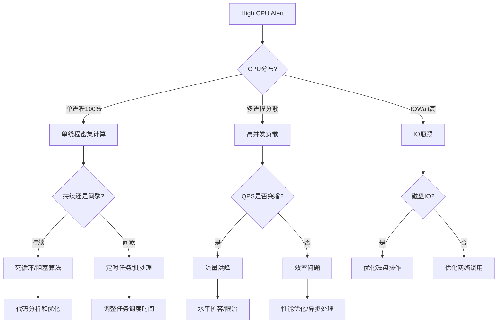

# CPU使用率过高故障排查手册

## 概述

### 问题描述
服务运行过程中CPU使用率持续超过80%，导致系统响应缓慢、请求处理能力下降、用户体验变差。

### 影响范围
- **影响级别**: Warning/Critical (根据使用率)
- **影响用户**: 部分或全部用户
- **业务影响**: 服务响应变慢、吞吐量下降、可能导致超时
- **性能影响**: QPS降低、延迟增加
- **优先级**: 高优先级，需要尽快响应

### 典型场景
- 流量突增导致CPU负载过高
- 死循环或低效算法
- 并发处理不当
- 定时任务扎堆执行
- 资源配置不足

---

## 症状识别

### 监控告警

**Warning级别 (80-90%)**:
```
AlertName: HighCPUUsage
Severity: Warning
Description: CPU usage > 80% for 5 minutes
Current Value: 85%
Instance: ai-platform-backend:8000
```

**Critical级别 (>90%)**:
```
AlertName: CriticalCPUUsage
Severity: Critical
Description: CPU usage > 90% for 2 minutes
Current Value: 95%
Instance: ai-platform-backend:8000
```

### 用户表现
- 页面加载缓慢
- API响应时间显著增加
- 请求超时频率上升
- 部分功能无响应

### Grafana 大盘
- "CPU Usage" 面板显示红色高位 (>80%)
- "Response Time P95" 显著上升
- "QPS" 可能上升或下降
- "Load Average" 持续高位
- "Context Switches" 频繁

---

## 快速诊断 (5分钟内完成)

### 诊断决策树



### 快速检查命令

```bash
# 1. CPU使用率概览 (10秒)
docker stats --no-stream

# 2. 进程CPU占用 TOP10 (10秒)
docker exec backend top -bn1 | head -20

# 3. 当前QPS (5秒)
curl 'http://localhost:9090/api/v1/query?query=rate(http_requests_total[1m])'

# 4. 线程CPU占用 (10秒)
docker exec backend top -Hbn1 | head -20

# 5. 系统负载 (5秒)
docker exec backend uptime
```

---

## 详细诊断步骤

### Step 1: 识别高CPU进程

**目标**: 找到消耗CPU的进程和线程

**容器级别检查**:
```bash
# 查看所有容器CPU使用
docker stats --no-stream

# 持续监控 (每2秒刷新)
docker stats --format "table {{.Name}}\t{{.CPUPerc}}\t{{.MemUsage}}"

# 只查看backend容器
docker stats backend --no-stream
```

**进程级别检查**:
```bash
# 查看进程CPU占用 (按CPU排序)
docker exec backend ps aux --sort=-%cpu | head -20

# 使用 top 命令交互式查看
docker exec -it backend top

# 批量模式获取快照
docker exec backend top -bn1 | head -20

# 查看所有Python进程
docker exec backend ps aux | grep python
```

**线程级别检查** (重要!):
```bash
# 显示线程CPU占用 (-H 参数)
docker exec backend top -Hbn1 | head -20

# 查看特定进程的线程
PID=$(docker exec backend pgrep -f uvicorn)
docker exec backend ps -T -p $PID

# 使用 htop (如果安装)
docker exec -it backend htop
```

**输出示例**:
```
PID   USER     %CPU %MEM  COMMAND
1234  root     98.5  2.3  python app/main.py
1235  root     45.2  1.1  python app/worker.py
```

**判断标准**:

| 场景 | CPU分布 | 可能原因 | 优先级 |
|------|---------|----------|--------|
| 单进程CPU 100% | 集中 | 死循环、阻塞算法、单线程瓶颈 | P0 |
| 多进程CPU均衡 | 分散 | 高并发、流量洪峰 | P1 |
| IOWait高 | CPU空闲但Load高 | 磁盘/网络IO瓶颈 | P1 |
| 系统进程高 | 非应用进程 | 系统问题、容器配置问题 | P2 |

### Step 2: 分析CPU占用原因

**Python应用性能分析 (推荐 py-spy)**:

```bash
# 安装 py-spy (如果未安装)
docker exec backend pip install py-spy

# 实时查看函数调用栈
PID=$(docker exec backend pgrep -f uvicorn)
docker exec backend py-spy top --pid $PID

# 生成30秒的火焰图
docker exec backend py-spy record -o /tmp/profile.svg --pid $PID --duration 30

# 复制火焰图到本地
docker cp backend:/tmp/profile.svg ./profile-$(date +%Y%m%d-%H%M%S).svg
```

**输出示例**:
```
%Own   %Total  OwnTime  TotalTime  Function (filename:line)
45.2%  45.2%   5.2s     5.2s       process_data (app/services/data.py:123)
32.1%  32.1%   3.7s     3.7s       calculate_score (app/utils/ml.py:456)
```

**使用cProfile进行详细分析**:
```python
# app/core/profiling.py

import cProfile
import pstats
import io
from functools import wraps

def profile_function(func):
    """函数性能分析装饰器"""
    @wraps(func)
    def wrapper(*args, **kwargs):
        pr = cProfile.Profile()
        pr.enable()

        result = func(*args, **kwargs)

        pr.disable()
        s = io.StringIO()
        ps = pstats.Stats(pr, stream=s).sort_stats('cumulative')
        ps.print_stats(20)  # 打印前20个函数
        print(s.getvalue())

        return result
    return wrapper

# 使用方法
@profile_function
@router.post("/expensive-operation")
async def expensive_operation(data: dict):
    # 你的代码
    return result
```

**系统级性能分析 (Linux perf)**:
```bash
# 记录30秒的性能数据
docker exec backend perf record -F 99 -p $PID -g -- sleep 30

# 生成报告
docker exec backend perf report

# 生成火焰图 (需要安装FlameGraph工具)
docker exec backend perf script | ./FlameGraph/stackcollapse-perf.pl | ./FlameGraph/flamegraph.pl > cpu-flamegraph.svg
```

### Step 3: 检查请求量和并发

**目标**: 判断是否是流量洪峰导致

**查询Prometheus指标**:
```bash
# 当前QPS
curl 'http://localhost:9090/api/v1/query?query=rate(http_requests_total[1m])'

# 过去24小时QPS趋势
curl 'http://localhost:9090/api/v1/query_range?query=rate(http_requests_total[5m])&start='$(date -d '24 hours ago' +%s)'&end='$(date +%s)'&step=300'

# 当前活跃连接数
curl 'http://localhost:9090/api/v1/query?query=http_connections_active'

# 请求延迟分位数
curl 'http://localhost:9090/api/v1/query?query=histogram_quantile(0.95, http_request_duration_seconds_bucket)'
```

**检查并发连接**:
```bash
# 查看TCP连接数
docker exec backend netstat -an | grep ESTABLISHED | wc -l

# 查看各状态连接数
docker exec backend netstat -an | awk '/^tcp/ {print $6}' | sort | uniq -c

# 查看连接到8000端口的数量
docker exec backend netstat -an | grep :8000 | grep ESTABLISHED | wc -l
```

**检查应用worker数量**:
```bash
# 查看uvicorn worker进程数
docker exec backend ps aux | grep uvicorn | grep -v grep | wc -l

# 查看每个worker的CPU使用
docker exec backend ps aux | grep "uvicorn worker"
```

**判断标准**:

| 指标 | 正常范围 | 当前值 | 诊断 |
|------|----------|--------|------|
| QPS | < 1000 | > 5000 | 流量突增 |
| 活跃连接数 | < 200 | > 1000 | 并发过高 |
| P95延迟 | < 500ms | > 2s | 处理缓慢 |
| Worker数 | 4-8 | 2 | 配置不足 |

### Step 4: 检查代码热点

**查看慢请求日志**:
```bash
# 查找处理时间超过1秒的请求
docker logs backend 2>&1 | grep "duration" | awk '$NF > 1000' | tail -20

# 统计慢请求的endpoint
docker logs backend 2>&1 | grep "duration" | awk '$NF > 1000' | awk '{print $(NF-2)}' | sort | uniq -c | sort -nr
```

**检查数据库查询**:
```sql
-- 连接PostgreSQL
docker exec -it postgres psql -U ai_platform

-- 查看正在执行的查询
SELECT pid, now() - pg_stat_activity.query_start AS duration, query, state
FROM pg_stat_activity
WHERE state != 'idle'
ORDER BY duration DESC;

-- 查看慢查询统计 (需要pg_stat_statements)
SELECT
    query,
    calls,
    total_exec_time / 1000 AS total_time_sec,
    mean_exec_time / 1000 AS mean_time_sec,
    max_exec_time / 1000 AS max_time_sec
FROM pg_stat_statements
ORDER BY mean_exec_time DESC
LIMIT 10;

-- 查看锁等待
SELECT
    blocked_locks.pid AS blocked_pid,
    blocked_activity.usename AS blocked_user,
    blocking_locks.pid AS blocking_pid,
    blocking_activity.usename AS blocking_user,
    blocked_activity.query AS blocked_statement,
    blocking_activity.query AS blocking_statement
FROM pg_catalog.pg_locks blocked_locks
JOIN pg_catalog.pg_stat_activity blocked_activity ON blocked_activity.pid = blocked_locks.pid
JOIN pg_catalog.pg_locks blocking_locks ON blocking_locks.locktype = blocked_locks.locktype
JOIN pg_catalog.pg_stat_activity blocking_activity ON blocking_activity.pid = blocking_locks.pid
WHERE NOT blocked_locks.granted;
```

**检查Redis性能**:
```bash
# 连接Redis
docker exec -it redis redis-cli

# 查看慢日志
SLOWLOG GET 10

# 实时监控命令
MONITOR  # 谨慎使用,会影响性能

# 查看命令统计
INFO commandstats

# 查看客户端连接
CLIENT LIST
```

### Step 5: 检查定时任务和批处理

**目标**: 确认是否有定时任务扎堆执行

**查看Celery任务** (如果使用):
```bash
# 查看活跃任务
docker exec backend celery -A app.celery inspect active

# 查看任务统计
docker exec backend celery -A app.celery inspect stats

# 查看任务队列
docker exec backend celery -A app.celery inspect reserved
```

**查看cron任务**:
```bash
# 查看容器内cron任务
docker exec backend crontab -l

# 查看cron执行日志
docker exec backend cat /var/log/cron.log
```

**检查APScheduler任务** (如果使用):
```python
# 添加任务监控endpoint
@router.get("/admin/scheduled-jobs")
async def get_scheduled_jobs():
    from app.core.scheduler import scheduler
    jobs = []
    for job in scheduler.get_jobs():
        jobs.append({
            "id": job.id,
            "name": job.name,
            "next_run": job.next_run_time,
            "trigger": str(job.trigger)
        })
    return {"jobs": jobs}
```

### Step 6: 检查系统资源

**CPU类型和限制**:
```bash
# 查看CPU信息
docker exec backend cat /proc/cpuinfo | grep "model name" | head -1
docker exec backend nproc  # CPU核心数

# 查看容器CPU限制
docker inspect backend | jq '.[0].HostConfig.CpuQuota'
docker inspect backend | jq '.[0].HostConfig.CpuPeriod'

# 计算CPU核心数限制 = CpuQuota / CpuPeriod
```

**系统负载**:
```bash
# Load Average (1分钟, 5分钟, 15分钟)
docker exec backend uptime
# Load average: 4.21, 3.45, 2.31

# 理想情况: Load <= CPU核心数
# 如果 Load > CPU核心数, 说明有任务在等待

# 查看系统资源总览
docker exec backend vmstat 1 5
```

**Context Switches (上下文切换)**:
```bash
# 查看上下文切换次数
docker exec backend vmstat 1 5

# 输出示例:
# procs -----------memory---------- ---swap-- -----io---- -system-- ------cpu-----
#  r  b   swpd   free   buff  cache   si   so    bi    bo   in   cs us sy id wa st
#  2  0      0 234567      0 345678    0    0     0     0  500 2000 80 10 10  0  0

# cs: context switches (上下文切换次数)
# 正常: < 1000/s
# 警告: > 10000/s (可能有大量线程竞争)
```

---

## 修复方案

### 自动修复

**场景1: 流量洪峰 - 水平扩容**:
```bash
# Docker Compose 快速扩容
docker-compose up -d --scale backend=3

# 验证扩容结果
docker ps | grep backend

# 配置Nginx负载均衡
# nginx.conf
upstream backend {
    least_conn;  # 最少连接数算法
    server backend_1:8000;
    server backend_2:8000;
    server backend_3:8000;
}
```

**场景2: CPU密集任务 - 异步处理**:
```python
# 修改前: 同步处理
@router.post("/process-data")
async def process_data(data: dict):
    result = heavy_computation(data)  # CPU密集
    return {"result": result}

# 修改后: 异步任务
from app.core.celery import celery_app

@celery_app.task
def heavy_computation_task(data: dict):
    return heavy_computation(data)

@router.post("/process-data")
async def process_data(data: dict):
    task = heavy_computation_task.delay(data)
    return {"task_id": task.id, "status": "processing"}

@router.get("/task-result/{task_id}")
async def get_task_result(task_id: str):
    task = celery_app.AsyncResult(task_id)
    return {"status": task.status, "result": task.result}
```

**场景3: 定时任务优化 - 分散执行**:
```python
# 修改前: 所有任务同时执行
scheduler.add_job(task1, 'cron', hour=0, minute=0)
scheduler.add_job(task2, 'cron', hour=0, minute=0)
scheduler.add_job(task3, 'cron', hour=0, minute=0)

# 修改后: 错峰执行
scheduler.add_job(task1, 'cron', hour=0, minute=0)
scheduler.add_job(task2, 'cron', hour=0, minute=15)
scheduler.add_job(task3, 'cron', hour=0, minute=30)
```

### 手动修复

**优化算法复杂度**:
```python
# 案例: N+1查询问题
# 修改前 (N+1查询)
@router.get("/users-with-posts")
async def get_users_with_posts(db: Session = Depends(get_db)):
    users = db.query(User).all()  # 1次查询
    for user in users:
        user.posts = db.query(Post).filter(Post.user_id == user.id).all()  # N次查询
    return users

# 修改后 (JOIN查询)
@router.get("/users-with-posts")
async def get_users_with_posts(db: Session = Depends(get_db)):
    users = db.query(User).options(joinedload(User.posts)).all()  # 1次查询
    return users
```

**优化数据库查询**:
```sql
-- 添加缺失的索引
CREATE INDEX idx_posts_user_id ON posts(user_id);
CREATE INDEX idx_posts_created_at ON posts(created_at);

-- 复合索引
CREATE INDEX idx_posts_user_created ON posts(user_id, created_at);

-- 分析查询计划
EXPLAIN ANALYZE
SELECT * FROM posts WHERE user_id = 123 ORDER BY created_at DESC LIMIT 10;
```

**增加缓存**:
```python
from functools import lru_cache
from app.core.redis import redis_client
import json

# 内存缓存 (适合小数据)
@lru_cache(maxsize=1000)
def get_user_config(user_id: int):
    # 计算密集型操作
    return calculate_config(user_id)

# Redis缓存 (适合大数据、分布式)
async def get_user_profile(user_id: int):
    cache_key = f"user:profile:{user_id}"

    # 尝试从缓存获取
    cached = redis_client.get(cache_key)
    if cached:
        return json.loads(cached)

    # 缓存未命中,查询数据库
    profile = await db.query(UserProfile).filter(UserProfile.user_id == user_id).first()

    # 写入缓存 (TTL 1小时)
    redis_client.setex(cache_key, 3600, json.dumps(profile))

    return profile
```

**优化并发配置**:
```yaml
# docker-compose.yml
services:
  backend:
    command: uvicorn app.main:app --host 0.0.0.0 --port 8000 --workers 4
    # workers数量 = CPU核心数 * 2 + 1

    deploy:
      resources:
        limits:
          cpus: '2.0'  # 限制CPU使用
```

**限流保护**:
```python
# app/middleware/rate_limit.py

from fastapi import Request, HTTPException
from slowapi import Limiter, _rate_limit_exceeded_handler
from slowapi.util import get_remote_address
from slowapi.errors import RateLimitExceeded

limiter = Limiter(key_func=get_remote_address)

@app.middleware("http")
async def rate_limit_middleware(request: Request, call_next):
    # 全局限流: 100 requests/minute
    @limiter.limit("100/minute")
    async def limited_call():
        return await call_next(request)

    try:
        return await limited_call()
    except RateLimitExceeded:
        raise HTTPException(status_code=429, detail="Too many requests")
```

---

## 预防措施

### 监控告警优化

**多级告警**:
```yaml
# prometheus/alerts.yml
groups:
  - name: cpu_alerts
    rules:
      # P2 - 预警
      - alert: CPUUsageWarning
        expr: (container_cpu_usage_seconds_total / container_spec_cpu_quota) > 0.7
        for: 5m
        labels:
          severity: warning
        annotations:
          summary: "CPU usage warning on {{ $labels.container }}"
          description: "CPU usage is {{ $value }}% for 5 minutes"

      # P1 - 告警
      - alert: CPUUsageHigh
        expr: (container_cpu_usage_seconds_total / container_spec_cpu_quota) > 0.85
        for: 2m
        labels:
          severity: warning
        annotations:
          summary: "High CPU usage on {{ $labels.container }}"

      # P0 - 紧急
      - alert: CPUUsageCritical
        expr: (container_cpu_usage_seconds_total / container_spec_cpu_quota) > 0.95
        for: 1m
        labels:
          severity: critical
        annotations:
          summary: "Critical CPU usage on {{ $labels.container }}"

      # 负载告警
      - alert: HighLoadAverage
        expr: node_load1 / count(node_cpu_seconds_total{mode="idle"}) > 2
        for: 5m
        labels:
          severity: warning
        annotations:
          summary: "High load average on {{ $labels.instance }}"
```

### 性能测试和容量规划

**压力测试**:
```bash
# 使用 wrk 进行压测
wrk -t12 -c400 -d30s --latency http://localhost:8000/api/v1/health

# 使用 locust 进行场景测试
# locustfile.py
from locust import HttpUser, task, between

class APIUser(HttpUser):
    wait_time = between(1, 3)

    @task(3)
    def get_users(self):
        self.client.get("/api/v1/users")

    @task(1)
    def create_post(self):
        self.client.post("/api/v1/posts", json={"title": "Test", "content": "..."})

# 运行测试
locust -f locustfile.py --host=http://localhost:8000 --users 100 --spawn-rate 10
```

**容量规划**:
- 确定单机QPS容量 (通过压测)
- 计算峰值流量需求
- 预留30%的冗余
- 制定扩容策略

### 代码优化最佳实践

**异步处理**:
```python
# 使用 asyncio 进行并发IO
import asyncio
import aiohttp

# 修改前: 串行请求
async def fetch_user_data(user_ids: List[int]):
    results = []
    for user_id in user_ids:
        result = await external_api.get(f"/users/{user_id}")  # 串行
        results.append(result)
    return results

# 修改后: 并发请求
async def fetch_user_data(user_ids: List[int]):
    tasks = [external_api.get(f"/users/{user_id}") for user_id in user_ids]
    results = await asyncio.gather(*tasks)  # 并发
    return results
```

**批处理优化**:
```python
# 修改前: 逐条处理
for item in items:
    db.add(Item(**item))
    db.commit()  # 每次都提交

# 修改后: 批量提交
db.bulk_insert_mappings(Item, items)
db.commit()  # 一次提交
```

**使用生成器节省内存**:
```python
# 修改前: 一次性加载
def process_large_file(file_path):
    lines = open(file_path).readlines()  # 全部加载到内存
    for line in lines:
        process(line)

# 修改后: 流式处理
def process_large_file(file_path):
    with open(file_path) as f:
        for line in f:  # 逐行读取
            process(line)
```

---

## 相关告警

| 告警名称 | 级别 | 说明 | 处理文档 |
|----------|------|------|----------|
| CPUUsageWarning | Warning | CPU > 70% 持续5分钟 | 本文档 |
| CPUUsageHigh | Warning | CPU > 85% 持续2分钟 | 本文档 |
| CPUUsageCritical | Critical | CPU > 95% 持续1分钟 | 本文档 |
| HighLoadAverage | Warning | 负载过高 | 本文档 |
| HighContextSwitches | Info | 上下文切换频繁 | 本文档 |
| HighResponseTime | Warning | 响应时间过长 | [service-down.md](./service-down.md) |

---

## 历史案例

### 案例1: N+1查询导致CPU过高 (2026-01-20)

**现象**:
- 16:00 收到 CPUUsageHigh 告警
- CPU使用率从20%飙升到90%
- API响应时间从200ms上升到5s

**诊断过程**:
1. 使用 py-spy 生成火焰图
2. 发现 `get_users_with_posts` 函数占用80% CPU
3. 查看代码,发现N+1查询问题

**根因**:
```python
# 问题代码
users = db.query(User).all()  # 1次查询,返回100个用户
for user in users:
    user.posts = db.query(Post).filter(Post.user_id == user.id).all()  # 100次查询!
```

**修复方案**:
```python
# 修复后
users = db.query(User).options(joinedload(User.posts)).all()  # 1次查询
```

**效果**:
- CPU使用率降低到25%
- API响应时间降低到150ms
- 数据库查询次数从101次降低到1次

### 案例2: 定时任务扎堆导致CPU尖峰 (2026-01-18)

**现象**:
- 每天凌晨0点,CPU使用率飙升到95%
- 持续15分钟后恢复正常
- 影响夜间批处理任务

**诊断过程**:
1. 查看CPU使用趋势,发现每天0点准时出现
2. 检查定时任务配置,发现5个任务同时在0点执行
3. 使用 top 命令确认是定时任务进程

**根因**:
- 数据同步、报表生成、日志清理、数据备份、统计计算
- 5个任务同时执行,CPU和IO资源竞争

**修复方案**:
```python
# 修改前
scheduler.add_job(sync_data, 'cron', hour=0, minute=0)
scheduler.add_job(generate_report, 'cron', hour=0, minute=0)
scheduler.add_job(cleanup_logs, 'cron', hour=0, minute=0)
scheduler.add_job(backup_data, 'cron', hour=0, minute=0)
scheduler.add_job(calculate_stats, 'cron', hour=0, minute=0)

# 修改后: 错峰执行
scheduler.add_job(sync_data, 'cron', hour=0, minute=0)
scheduler.add_job(generate_report, 'cron', hour=0, minute=20)
scheduler.add_job(cleanup_logs, 'cron', hour=1, minute=0)
scheduler.add_job(backup_data, 'cron', hour=2, minute=0)
scheduler.add_job(calculate_stats, 'cron', hour=3, minute=0)
```

**效果**:
- 峰值CPU从95%降低到45%
- 任务执行时间分散,互不影响
- 系统夜间负载平稳

### 案例3: 缺少索引导致CPU持续高位 (2026-01-12)

**现象**:
- 新功能上线后,CPU使用率持续80%
- 数据库查询缓慢
- 用户反馈列表页加载慢

**诊断过程**:
1. 查看数据库慢查询日志
2. 发现 `SELECT * FROM posts WHERE status = 'published' ORDER BY created_at DESC` 耗时3s
3. EXPLAIN分析查询计划: Seq Scan (全表扫描)

**根因**:
- 新增的 status 字段没有索引
- 表有500万条数据,全表扫描耗时长
- 高频查询导致CPU和IO持续高位

**修复方案**:
```sql
-- 添加索引
CREATE INDEX idx_posts_status_created ON posts(status, created_at DESC);

-- 验证查询计划
EXPLAIN ANALYZE
SELECT * FROM posts WHERE status = 'published' ORDER BY created_at DESC LIMIT 20;
-- Index Scan (索引扫描, 耗时 5ms)
```

**效果**:
- 查询时间从3s降低到5ms
- CPU使用率从80%降低到30%
- 用户体验显著提升

---

## 相关文档

- [服务不可用排查](./service-down.md)
- [内存泄漏排查](./memory-leak.md)
- [数据库性能问题](./database-slow.md)
- [性能优化指南](../runbooks/performance-tuning.md)

---

## 快速参考

### 一键诊断脚本

```bash
#!/bin/bash
# 快速诊断CPU过高问题

SERVICE_NAME="backend"
OUTPUT_DIR="/tmp/cpu-diagnosis-$(date +%Y%m%d-%H%M%S)"
mkdir -p $OUTPUT_DIR

echo "=== CPU使用率过高快速诊断 ==="
echo "诊断结果将保存到: $OUTPUT_DIR"
echo ""

# 1. CPU使用率
echo "1. 检查CPU使用率..."
docker stats --no-stream > $OUTPUT_DIR/docker-stats.txt
cat $OUTPUT_DIR/docker-stats.txt
echo ""

# 2. 进程CPU占用 TOP10
echo "2. 检查进程CPU占用..."
docker exec $SERVICE_NAME ps aux --sort=-%cpu | head -20 > $OUTPUT_DIR/process-cpu.txt
cat $OUTPUT_DIR/process-cpu.txt
echo ""

# 3. 线程CPU占用
echo "3. 检查线程CPU占用..."
docker exec $SERVICE_NAME top -Hbn1 | head -20 > $OUTPUT_DIR/thread-cpu.txt
cat $OUTPUT_DIR/thread-cpu.txt
echo ""

# 4. 系统负载
echo "4. 检查系统负载..."
docker exec $SERVICE_NAME uptime > $OUTPUT_DIR/uptime.txt
cat $OUTPUT_DIR/uptime.txt
echo ""

# 5. 当前QPS
echo "5. 检查当前QPS..."
curl -s 'http://localhost:9090/api/v1/query?query=rate(http_requests_total[1m])' | jq '.' > $OUTPUT_DIR/qps.json
echo ""

# 6. 生成火焰图
echo "6. 生成性能火焰图 (30秒)..."
PID=$(docker exec $SERVICE_NAME pgrep -f uvicorn | head -1)
if [ ! -z "$PID" ]; then
    docker exec $SERVICE_NAME py-spy record -o /tmp/flamegraph.svg --pid $PID --duration 30
    docker cp $SERVICE_NAME:/tmp/flamegraph.svg $OUTPUT_DIR/flamegraph.svg
    echo "火焰图已生成: $OUTPUT_DIR/flamegraph.svg"
else
    echo "无法找到uvicorn进程"
fi
echo ""

# 7. 数据库慢查询
echo "7. 检查数据库慢查询..."
docker exec postgres psql -U ai_platform -c "SELECT query, calls, mean_exec_time FROM pg_stat_statements ORDER BY mean_exec_time DESC LIMIT 10;" > $OUTPUT_DIR/slow-queries.txt
cat $OUTPUT_DIR/slow-queries.txt
echo ""

echo "=== 诊断完成 ==="
echo "完整报告: $OUTPUT_DIR"
```

保存为 `/usr/local/bin/diagnose-high-cpu.sh`,添加执行权限。
