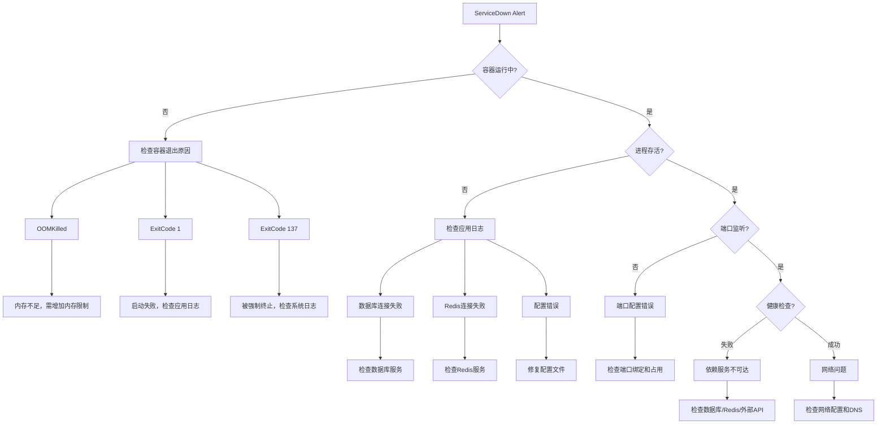

# 服务不可用故障排查手册

## 概述

### 问题描述
服务完全不可用，用户无法访问系统，所有HTTP请求失败，返回502 Bad Gateway或连接超时错误。

### 影响范围
- **影响级别**: Critical (P0)
- **影响用户**: 全部用户
- **业务影响**: 系统完全不可用，所有功能无法使用
- **SLA影响**: 可用性指标直接受影响
- **优先级**: 最高优先级，需要立即响应

### 典型场景
- 部署后服务启动失败
- 运行中服务突然崩溃
- 容器被OOM Kill
- 依赖服务故障导致连锁反应
- 资源耗尽导致服务无响应

---

## 症状识别

### 监控告警
```
AlertName: ServiceDown
Severity: Critical
Description: Backend service is down for more than 1 minute
Instance: ai-platform-backend:8000
Labels:
  - service: backend
  - environment: production
  - severity: critical
```

### 用户表现
- 浏览器显示 "502 Bad Gateway"
- 请求超时 (Timeout)
- 连接被拒绝 (Connection Refused)
- 健康检查端点不可达

### Grafana 大盘
- "Service Availability" 面板显示红色 (Down)
- "HTTP Request Rate" 骤降为 0
- "Active Connections" 归零
- "Container Status" 显示异常状态

---

## 快速诊断 (5分钟内完成)

### 诊断决策树



### 快速检查命令

```bash
# 1. 容器状态 (30秒)
docker ps -a | grep backend
docker inspect backend | jq '.[0].State'

# 2. 进程状态 (10秒)
docker exec backend ps aux | grep uvicorn

# 3. 端口监听 (10秒)
docker exec backend netstat -tlnp | grep 8000

# 4. 健康检查 (10秒)
curl -f http://localhost:8000/health

# 5. 最近日志 (20秒)
docker logs --tail 50 backend
```

---

## 详细诊断步骤

### Step 1: 检查容器状态

**目标**: 确认容器是否在运行

**命令**:
```bash
# 查看容器列表
docker ps -a | grep backend

# 检查容器详细状态
docker inspect backend | jq '.[0].State'

# 查看容器重启次数
docker inspect backend | jq '.[0].RestartCount'

# 检查容器资源使用
docker stats backend --no-stream
```

**判断标准**:

| 状态 | 描述 | 可能原因 | 下一步 |
|------|------|----------|--------|
| Running | 容器正常运行 | 进程或配置问题 | 进入 Step 2 |
| Exited | 容器已退出 | 启动失败或崩溃 | 查看退出码和日志 |
| Restarting | 容器不断重启 | 启动失败循环 | 查看启动日志 |
| Not Found | 容器不存在 | 未部署或被删除 | 检查部署状态 |

**退出码含义**:
- `0`: 正常退出 (不太可能)
- `1`: 应用错误退出
- `137`: 被 Kill 信号终止 (可能是 OOM)
- `139`: Segmentation Fault
- `143`: 被 SIGTERM 终止

**OOMKilled 检查**:
```bash
# 检查是否被 OOM Kill
docker inspect backend | jq '.[0].State.OOMKilled'

# 查看系统 OOM 日志
dmesg | grep -i "out of memory"
journalctl -u docker | grep -i "oom"
```

### Step 2: 检查进程状态

**目标**: 确认服务进程是否在容器内运行

**命令**:
```bash
# 查看进程列表
docker exec backend ps aux

# 查看 uvicorn 进程
docker exec backend ps aux | grep uvicorn | grep -v grep

# 查看进程树
docker exec backend pstree -p

# 检查进程 PID 1 状态 (重要!)
docker exec backend ps -p 1 -o pid,cmd,stat,start
```

**判断标准**:

| 场景 | 诊断 | 可能原因 |
|------|------|----------|
| 无 uvicorn 进程 | 服务未启动 | 启动脚本失败、依赖服务不可用 |
| 进程存在但僵尸 | 进程卡死 | 死锁、资源耗尽 |
| 进程CPU 100% | 死循环或高负载 | 代码bug、流量洪峰 |
| 进程内存过高 | 内存泄漏 | 内存管理问题 |

**查看启动日志**:
```bash
# 查看容器启动输出
docker logs backend 2>&1 | head -100

# 查看最近错误
docker logs backend 2>&1 | grep -i error | tail -20

# 查看启动相关日志
docker logs backend 2>&1 | grep -i "starting\|listening\|failed\|error"
```

### Step 3: 检查端口监听

**目标**: 确认服务是否在监听端口

**命令**:
```bash
# 检查端口监听 (推荐)
docker exec backend netstat -tlnp | grep 8000

# 或使用 ss 命令
docker exec backend ss -tlnp | grep 8000

# 检查所有监听端口
docker exec backend netstat -tlnp

# 从外部测试端口连通性
nc -zv localhost 8000

# 使用 telnet 测试
telnet localhost 8000
```

**判断标准**:

| 结果 | 诊断 | 处理方法 |
|------|------|----------|
| 0.0.0.0:8000 LISTEN | 正常监听所有接口 | 进入 Step 4 |
| 127.0.0.1:8000 LISTEN | 只监听本地 | 修改为 0.0.0.0 |
| 无输出 | 端口未监听 | 检查应用启动 |
| 端口被占用 | 端口冲突 | 查找占用进程 |

**端口占用处理**:
```bash
# 查找占用端口的进程
docker exec backend lsof -i :8000

# 或使用 netstat
docker exec backend netstat -tlnp | grep 8000

# 杀掉占用进程 (谨慎操作)
docker exec backend kill -9 <PID>
```

### Step 4: 检查健康检查端点

**目标**: 验证应用是否能正常响应

**命令**:
```bash
# 测试健康检查端点
curl -v http://localhost:8000/health

# 测试就绪检查端点
curl -v http://localhost:8000/ready

# 查看完整响应头
curl -i http://localhost:8000/health

# 设置超时时间
curl --max-time 5 http://localhost:8000/health

# 从容器内测试
docker exec backend curl -f http://localhost:8000/health
```

**响应分析**:

| HTTP状态码 | 诊断 | 可能原因 |
|-----------|------|----------|
| 200 | 健康检查通过 | 进入 Step 5 (网络问题) |
| 500 | 服务内部错误 | 依赖服务故障、代码错误 |
| 503 | 服务不可用 | 依赖服务连接失败 |
| 超时 | 服务无响应 | 死锁、资源耗尽、高负载 |
| Connection Refused | 端口未监听 | 返回 Step 3 |

**健康检查失败时的详细检查**:
```bash
# 查看健康检查日志
docker logs backend 2>&1 | grep -i "health\|ready"

# 检查数据库连接
docker exec backend python -c "
from app.core.database import engine
from sqlalchemy import text
try:
    with engine.connect() as conn:
        result = conn.execute(text('SELECT 1'))
        print('Database OK')
except Exception as e:
    print(f'Database Error: {e}')
"

# 检查 Redis 连接
docker exec backend python -c "
from app.core.redis import redis_client
try:
    redis_client.ping()
    print('Redis OK')
except Exception as e:
    print(f'Redis Error: {e}')
"
```

### Step 5: 检查网络连通性

**目标**: 排查网络和DNS问题

**命令**:
```bash
# 检查容器网络配置
docker network inspect ai-platform_default

# 测试容器间通信
docker exec backend ping -c 3 postgres
docker exec backend ping -c 3 redis

# 测试 DNS 解析
docker exec backend nslookup postgres
docker exec backend nslookup redis

# 检查路由
docker exec backend ip route

# 测试外部网络
docker exec backend ping -c 3 8.8.8.8
docker exec backend curl -I https://www.google.com
```

**判断标准**:

| 场景 | 诊断 | 处理方法 |
|------|------|----------|
| Ping 不通内部服务 | 网络隔离 | 检查 Docker 网络配置 |
| DNS 解析失败 | DNS 配置错误 | 修改 /etc/hosts 或 DNS 服务器 |
| 外网不通 | 网络限制 | 检查防火墙和路由 |
| 所有正常但服务不可用 | 应用层问题 | 深入检查应用日志 |

### Step 6: 检查依赖服务

**目标**: 确认所有依赖服务正常

**数据库检查**:
```bash
# 检查 PostgreSQL 容器
docker ps | grep postgres

# 测试数据库连接
docker exec postgres pg_isready -U ai_platform

# 查看数据库日志
docker logs --tail 50 postgres

# 检查数据库连接数
docker exec postgres psql -U ai_platform -c "SELECT count(*) FROM pg_stat_activity;"

# 检查数据库锁
docker exec postgres psql -U ai_platform -c "SELECT * FROM pg_locks WHERE NOT granted;"
```

**Redis 检查**:
```bash
# 检查 Redis 容器
docker ps | grep redis

# 测试 Redis 连接
docker exec redis redis-cli ping

# 查看 Redis 日志
docker logs --tail 50 redis

# 检查 Redis 连接数
docker exec redis redis-cli CLIENT LIST | wc -l

# 检查 Redis 内存
docker exec redis redis-cli INFO memory
```

### Step 7: 深入分析应用日志

**目标**: 从日志中找到根因

**查看策略**:
```bash
# 查看最近 100 行日志
docker logs --tail 100 backend

# 查看错误日志
docker logs backend 2>&1 | grep -i "error\|exception\|fatal\|critical"

# 查看启动日志
docker logs backend 2>&1 | grep -i "starting\|listening\|started"

# 按时间范围查看
docker logs --since "2026-01-24T14:00:00" backend

# 实时查看日志
docker logs -f backend

# 导出完整日志
docker logs backend > /tmp/backend-$(date +%Y%m%d-%H%M%S).log
```

**常见错误模式**:

| 错误信息 | 根因 | 修复方案 |
|----------|------|----------|
| `Connection refused` | 依赖服务不可用 | 检查并启动依赖服务 |
| `ModuleNotFoundError` | Python 依赖缺失 | 重新构建镜像 |
| `Permission denied` | 文件权限问题 | 修改文件权限或用户 |
| `Address already in use` | 端口被占用 | 杀掉占用进程或更换端口 |
| `Out of memory` | 内存不足 | 增加容器内存限制 |
| `Database connection failed` | 数据库不可用 | 检查数据库服务和连接配置 |

---

## 修复方案

### 自动修复 (推荐)

**场景1: 容器已停止**
```bash
# 重启容器
docker restart backend

# 等待服务就绪
sleep 5

# 验证服务状态
curl -f http://localhost:8000/health
```

**场景2: OOMKilled**
```bash
# 临时增加内存限制并重启
docker update --memory="4g" --memory-swap="4g" backend
docker restart backend

# 永久修复: 修改 docker-compose.yml
# services:
#   backend:
#     deploy:
#       resources:
#         limits:
#           memory: 4G
```

**场景3: 依赖服务不可用**
```bash
# 启动所有依赖服务
docker-compose up -d postgres redis

# 等待依赖就绪
sleep 10

# 重启应用服务
docker restart backend
```

**场景4: 配置错误**
```bash
# 修复环境变量
docker-compose down
# 修改 .env 文件
docker-compose up -d

# 或直接修改运行中的容器配置 (临时)
docker exec backend sh -c 'export DATABASE_URL="..."'
docker restart backend
```

### 手动修复

**完全重建容器**:
```bash
# 停止并删除容器
docker-compose down

# 清理旧镜像 (可选)
docker rmi ai-platform-backend

# 重新构建镜像
docker-compose build backend

# 启动服务
docker-compose up -d

# 查看启动日志
docker-compose logs -f backend
```

**数据库修复**:
```bash
# 重启数据库
docker restart postgres

# 检查数据库完整性
docker exec postgres pg_checksums --enable

# 重建索引
docker exec postgres psql -U ai_platform -c "REINDEX DATABASE ai_platform;"

# 清理锁
docker exec postgres psql -U ai_platform -c "
SELECT pg_terminate_backend(pid)
FROM pg_stat_activity
WHERE datname = 'ai_platform' AND state = 'idle in transaction';
"
```

**Redis 修复**:
```bash
# 重启 Redis
docker restart redis

# 清理 Redis (谨慎操作!)
docker exec redis redis-cli FLUSHALL

# 检查 Redis 持久化
docker exec redis redis-cli BGSAVE
docker exec redis redis-cli LASTSAVE
```

### 回滚部署

```bash
# 查看部署历史
docker images | grep backend

# 回滚到上一个版本
docker tag backend:latest backend:failed-$(date +%Y%m%d)
docker pull backend:v1.0.0  # 或从仓库拉取稳定版本
docker tag backend:v1.0.0 backend:latest

# 重启服务
docker-compose down
docker-compose up -d

# 验证回滚成功
curl -f http://localhost:8000/health
```

---

## 预防措施

### 监控告警优化

**添加预警告警**:
```yaml
# prometheus/alerts.yml
groups:
  - name: service_health_warnings
    rules:
      # 容器重启告警
      - alert: ContainerRestarting
        expr: rate(container_restart_count[5m]) > 0
        for: 1m
        labels:
          severity: warning
        annotations:
          summary: "Container {{ $labels.name }} is restarting"
          description: "Container has restarted {{ $value }} times in the last 5 minutes"

      # 健康检查失败预警
      - alert: HealthCheckDegraded
        expr: probe_success == 0
        for: 30s
        labels:
          severity: warning
        annotations:
          summary: "Health check failing for {{ $labels.instance }}"

      # 内存使用预警 (80%)
      - alert: HighMemoryWarning
        expr: (container_memory_usage_bytes / container_spec_memory_limit_bytes) > 0.8
        for: 2m
        labels:
          severity: warning
        annotations:
          summary: "High memory usage on {{ $labels.container }}"
```

### 自动修复配置

**Docker 自动重启策略**:
```yaml
# docker-compose.yml
services:
  backend:
    restart: unless-stopped  # 推荐
    # restart: always        # 总是重启
    # restart: on-failure:3  # 失败时重启,最多3次

    healthcheck:
      test: ["CMD", "curl", "-f", "http://localhost:8000/health"]
      interval: 30s
      timeout: 10s
      retries: 3
      start_period: 40s
```

**Kubernetes 自动恢复** (如果使用K8s):
```yaml
apiVersion: apps/v1
kind: Deployment
spec:
  replicas: 3  # 多副本保证高可用
  template:
    spec:
      containers:
      - name: backend
        livenessProbe:
          httpGet:
            path: /health
            port: 8000
          initialDelaySeconds: 30
          periodSeconds: 10
          timeoutSeconds: 5
          failureThreshold: 3

        readinessProbe:
          httpGet:
            path: /ready
            port: 8000
          initialDelaySeconds: 10
          periodSeconds: 5
```

### 资源限制优化

```yaml
# docker-compose.yml
services:
  backend:
    deploy:
      resources:
        limits:
          cpus: '2.0'
          memory: 4G
        reservations:
          cpus: '0.5'
          memory: 1G

    # 设置合理的 ulimit
    ulimits:
      nofile:
        soft: 65536
        hard: 65536
      nproc: 65535
```

### 代码优化建议

**改进健康检查逻辑**:
```python
# app/api/v1/endpoints/health.py

from fastapi import APIRouter, status
from app.core.database import engine
from app.core.redis import redis_client
import logging

logger = logging.getLogger(__name__)
router = APIRouter()

@router.get("/health")
async def health_check():
    """健康检查 - 快速响应,用于存活探测"""
    return {"status": "healthy"}

@router.get("/ready")
async def readiness_check():
    """就绪检查 - 检查依赖服务,用于流量切换"""
    checks = {
        "database": False,
        "redis": False,
    }

    # 检查数据库
    try:
        with engine.connect() as conn:
            conn.execute("SELECT 1")
        checks["database"] = True
    except Exception as e:
        logger.error(f"Database check failed: {e}")

    # 检查 Redis
    try:
        redis_client.ping()
        checks["redis"] = True
    except Exception as e:
        logger.error(f"Redis check failed: {e}")

    # 所有检查通过才返回 200
    if all(checks.values()):
        return {"status": "ready", "checks": checks}
    else:
        return status.HTTP_503_SERVICE_UNAVAILABLE, {
            "status": "not_ready",
            "checks": checks
        }
```

**优化启动顺序**:
```yaml
# docker-compose.yml
services:
  backend:
    depends_on:
      postgres:
        condition: service_healthy
      redis:
        condition: service_healthy

  postgres:
    healthcheck:
      test: ["CMD-SHELL", "pg_isready -U ai_platform"]
      interval: 5s
      timeout: 5s
      retries: 5

  redis:
    healthcheck:
      test: ["CMD", "redis-cli", "ping"]
      interval: 5s
      timeout: 3s
      retries: 5
```

---

## 相关告警

### 关联告警规则

| 告警名称 | 级别 | 说明 | 处理文档 |
|----------|------|------|----------|
| ServiceDown | Critical | 服务完全不可用 | 本文档 |
| HighRestartRate | Warning | 容器频繁重启 | [alerts/critical.md](../alerts/critical.md) |
| HealthCheckFailing | Warning | 健康检查失败 | [alerts/warning.md](../alerts/warning.md) |
| HighMemoryUsage | Warning | 内存使用率过高 | [memory-leak.md](./memory-leak.md) |
| DatabaseConnectionFailed | Critical | 数据库连接失败 | [database-slow.md](./database-slow.md) |

### 告警升级路径

```
HealthCheckFailing (Warning)
    ↓ 持续 2 分钟
ServiceDegraded (Warning)
    ↓ 持续 1 分钟
ServiceDown (Critical)
    ↓ 触发
自动修复 / 人工介入
```

---

## 历史案例

### 案例1: OOM导致服务不可用 (2026-01-15)

**现象**:
- 14:30 收到 ServiceDown 告警
- 用户报告无法访问系统
- Grafana 显示服务下线

**诊断过程**:
1. 检查容器状态: `Exited (137)`
2. 查看容器日志: `Out of memory`
3. 确认是 OOMKilled: `"OOMKilled": true`

**根因**:
- 处理大文件上传时,一次性读取文件到内存
- 容器内存限制 2GB,文件大小 1.5GB
- 多个并发上传导致内存溢出

**修复方案**:
1. 临时: 重启容器,增加内存限制到 4GB
2. 永久: 优化文件上传逻辑,使用流式处理

**预防措施**:
- 添加内存使用预警 (85%)
- 代码审查: 确保所有文件操作使用流式处理
- 添加文件大小限制 (单文件最大 500MB)

**代码改进**:
```python
# 修改前 (一次性加载)
@router.post("/upload")
async def upload_file(file: UploadFile):
    content = await file.read()  # ❌ 全部读入内存
    return process_file(content)

# 修改后 (流式处理)
@router.post("/upload")
async def upload_file(file: UploadFile):
    # ✅ 分块读取,流式处理
    async for chunk in file.stream():
        await process_chunk(chunk)
    return {"status": "success"}
```

### 案例2: 数据库连接耗尽 (2026-01-10)

**现象**:
- 15:20 收到 ServiceDown 告警
- 健康检查端点返回 503
- 日志显示 "Database connection pool exhausted"

**诊断过程**:
1. 检查容器和进程: 正常运行
2. 测试健康检查: 返回 503,提示数据库连接失败
3. 检查数据库连接数: 已达到最大限制 100

**根因**:
- 连接池配置过小 (max_connections=10)
- 某些长查询未释放连接
- 并发请求增加导致连接不足

**修复方案**:
1. 临时: 杀掉空闲连接,重启服务
2. 永久: 增加连接池大小,设置连接超时

**配置改进**:
```python
# 修改前
engine = create_engine(
    DATABASE_URL,
    pool_size=10,
    max_overflow=0
)

# 修改后
engine = create_engine(
    DATABASE_URL,
    pool_size=20,           # 增加连接池
    max_overflow=10,        # 允许溢出连接
    pool_timeout=30,        # 连接超时
    pool_recycle=3600,      # 定期回收连接
    pool_pre_ping=True      # 连接前检查
)
```

### 案例3: Docker 网络故障 (2026-01-05)

**现象**:
- 10:15 收到 ServiceDown 告警
- 容器运行正常,但无法访问
- 容器内 ping 外部服务失败

**诊断过程**:
1. 检查容器和进程: 正常
2. 测试容器间通信: 失败
3. 检查 Docker 网络: 网络配置异常

**根因**:
- Docker 守护进程重启导致网络桥接失效
- 容器网络配置未自动恢复

**修复方案**:
1. 重启 Docker 守护进程
2. 重建容器网络
3. 重启所有容器

**预防措施**:
- 监控 Docker 守护进程状态
- 定期检查网络连通性
- 使用外部网络 (不依赖 Docker 网络)

---

## 相关文档

- [高CPU使用率排查](./high-cpu.md)
- [内存泄漏排查](./memory-leak.md)
- [数据库性能问题](./database-slow.md)
- [部署操作手册](../runbooks/deployment.md)
- [Critical告警处理](../alerts/critical.md)

---

## 快速参考

### 一键诊断脚本

```bash
#!/bin/bash
# 快速诊断服务不可用问题

SERVICE_NAME="backend"

echo "=== 服务不可用快速诊断 ==="
echo ""

# 1. 容器状态
echo "1. 检查容器状态..."
docker ps -a | grep $SERVICE_NAME
docker inspect $SERVICE_NAME | jq '.[0].State'
echo ""

# 2. 进程状态
echo "2. 检查进程状态..."
docker exec $SERVICE_NAME ps aux | grep uvicorn || echo "进程未运行"
echo ""

# 3. 端口监听
echo "3. 检查端口监听..."
docker exec $SERVICE_NAME netstat -tlnp | grep 8000 || echo "端口未监听"
echo ""

# 4. 健康检查
echo "4. 检查健康状态..."
curl -f http://localhost:8000/health || echo "健康检查失败"
echo ""

# 5. 最近日志
echo "5. 查看最近日志..."
docker logs --tail 20 $SERVICE_NAME
echo ""

echo "=== 诊断完成 ==="
```

### 快速修复脚本

```bash
#!/bin/bash
# 快速修复服务不可用问题

SERVICE_NAME="backend"

echo "=== 开始快速修复 ==="

# 1. 尝试重启容器
echo "1. 重启容器..."
docker restart $SERVICE_NAME

# 2. 等待服务就绪
echo "2. 等待服务就绪..."
sleep 10

# 3. 验证服务状态
echo "3. 验证服务状态..."
if curl -f http://localhost:8000/health > /dev/null 2>&1; then
    echo "✅ 服务已恢复"
    exit 0
else
    echo "❌ 服务仍然不可用,需要深入排查"
    echo "请运行: docker logs $SERVICE_NAME"
    exit 1
fi
```

保存为 `/usr/local/bin/diagnose-service-down.sh` 和 `/usr/local/bin/fix-service-down.sh`,并添加执行权限。
