# 蒙智云AI赋能云平台 — 大创申报技术架构文档

> **项目名称**: 蒙智云AI赋能云平台（内蒙古农产品AI营销云）
> **文档版本**: 1.0
> **编制日期**: 2026-06-17
> **文档定位**: 大学生创新创业训练计划申报 — 技术可行性论证

---

## 1. 项目概述

蒙智云AI赋能云平台是一个面向内蒙古特色农产品营销场景的SaaS级智能平台，深度融合大语言模型（LLM）、知识图谱（KG）、检索增强生成（RAG）、多模态内容生成与多平台分发等AI技术，为政府、企业和农户提供从内容创作、智能客服、品牌IP孵化到效果监测的一体化AI营销解决方案。

### 1.1 核心业务场景

| 场景 | AI能力 | 业务价值 |
|------|-------|---------|
| **产品营销内容生成** | LLM + Few-Shot Prompt | 1分钟生成多平台文案，效率提升10x |
| **智能客服7×24h** | RAG + Function Calling | 工单自动解决率≥70% |
| **直播话术实时生成** | 流式LLM + 上下文融合 | 直播间互动转化率提升25% |
| **品牌IP智能体** | Agent + 长期记忆 | 0成本打造数字员工 |
| **多平台一键分发** | 适配器模式 + 异步编排 | 一次创作，4平台同步 |
| **效果监测分析** | 事件流 + 实时聚合 | 数据驱动营销决策 |
| **文化知识图谱** | 隐式KG + 路径推理 | 农产品文化故事挖掘 |

### 1.2 技术栈总览

| 层级 | 技术选型 | 说明 |
|------|---------|------|
| **前端** | Vue 3 + TypeScript + Element Plus + Vite | 组件化、类型安全 |
| **后端** | FastAPI + SQLAlchemy 2.x + Pydantic v2 | 异步、高性能、自动文档 |
| **AI框架** | LangChain + 自研Agent | 灵活扩展、国产模型友好 |
| **LLM** | 通义千问 / DeepSeek / OpenAI兼容接口 | 多模型路由、国产化优先 |
| **数据库** | PostgreSQL（主）+ Redis（缓存/队列）+ Elasticsearch（搜索）| 关系+缓存+全文检索 |
| **多租户** | Schema-per-Tenant 隔离 | 企业级数据隔离 |
| **部署** | Docker + Nginx + Systemd | 轻量级私有化部署 |
| **监控** | Prometheus + Grafana + Sentry | 全链路可观测 |

---

## 2. 总体架构

### 2.1 系统分层架构图

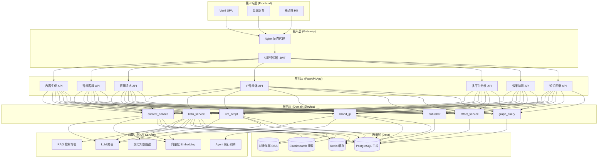

### 2.2 部署架构图

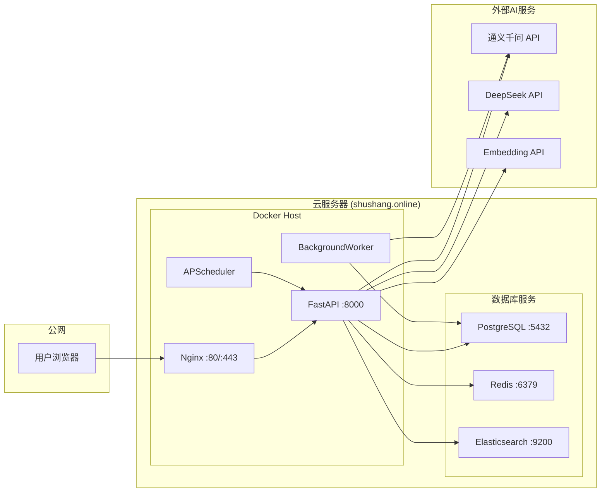

---

## 3. 核心算法与AI能力

### 3.1 大语言模型路由策略

平台采用**多模型动态路由**架构，根据任务类型、成本、延迟自动选择最合适的LLM。

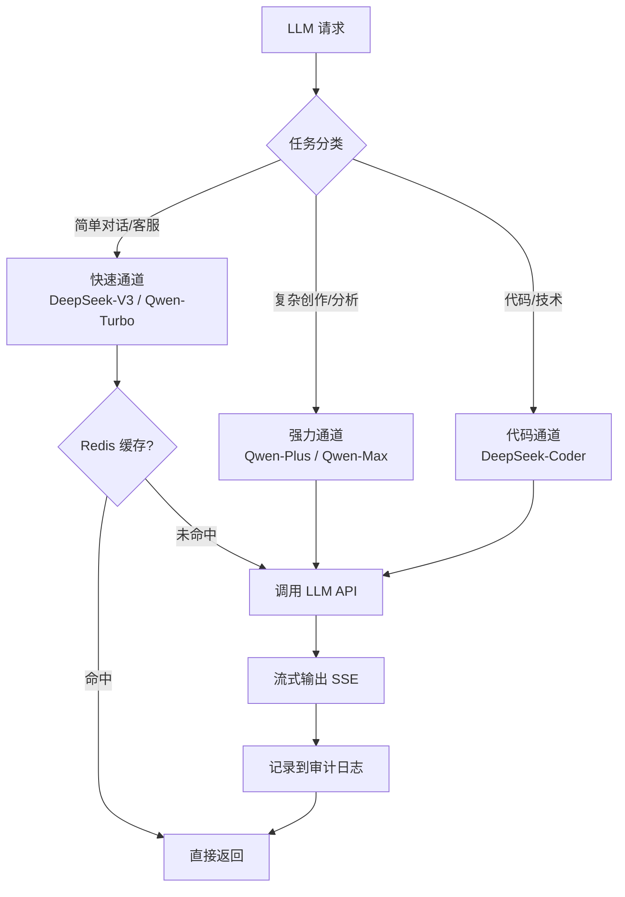

**核心设计要点**：
- **缓存复用**: 高频问答场景使用Redis缓存，命中率可达40%+
- **流式响应**: Server-Sent Events（SSE）协议，首token延迟<500ms
- **降级熔断**: 单一模型故障时自动切换备用模型

### 3.2 检索增强生成 (RAG) 流程

智能客服模块基于RAG架构，融合企业知识库与文化元素知识图谱。

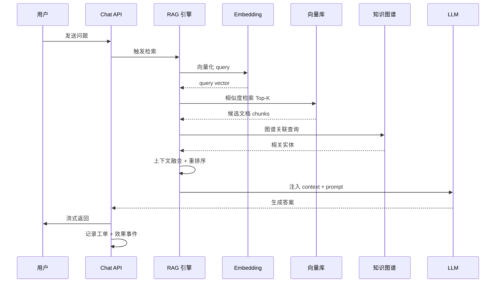

**关键技术**：
- **混合检索**: 向量检索（语义）+ 关键词检索（BM25） + 知识图谱（关系）
- **Re-Rank**: Cross-Encoder模型对Top-50候选重排序
- **Context Compression**: 长文档自动切片、提取关键句

### 3.3 多智能体 (Agent) 编排

品牌IP智能体采用 **ReAct + Function Calling** 架构，支持长期记忆与多步推理。

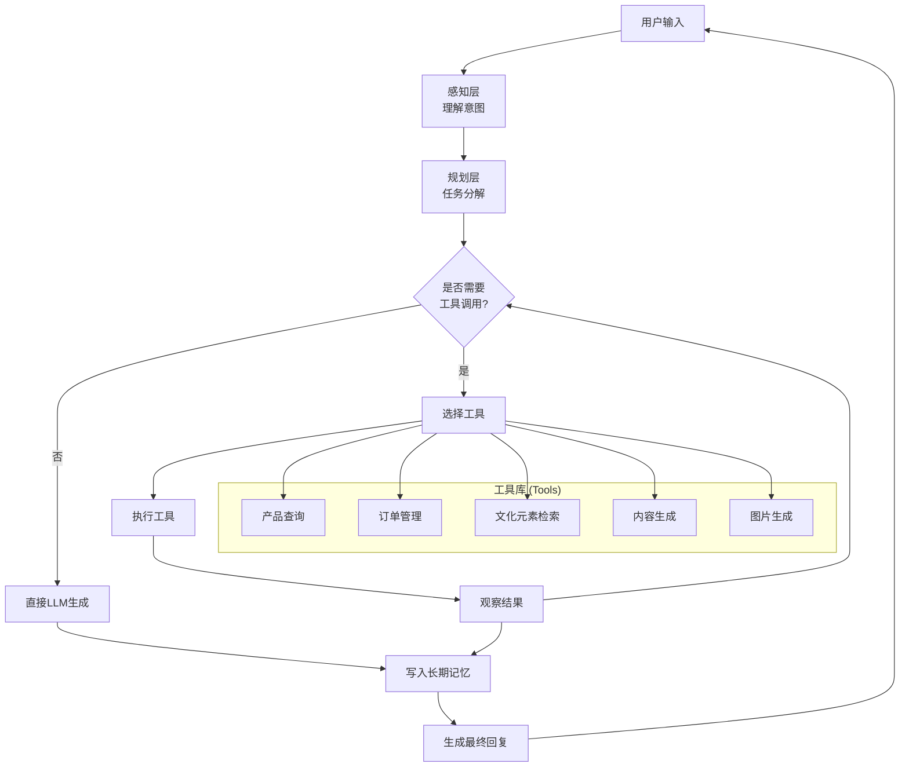

### 3.4 文化元素知识图谱（隐式图）

不引入Neo4j等图数据库，复用PostgreSQL的CulturalElement表，通过**共享属性**定义隐式边。

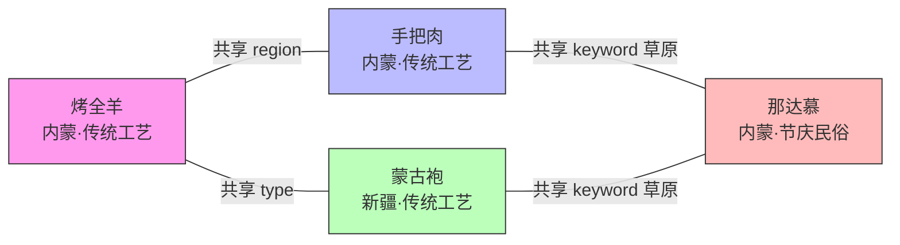

**边定义**：
- 共享 `origin_region`（产地）
- 共享 `type`（类型）
- 共享至少1个 `keyword`（关键词）

**核心算法**：
| 算法 | 用途 | 复杂度 |
|------|------|--------|
| **BFS 路径查询** | find_path(source, target) | O(V+E) |
| **共同邻居推荐** | recommend_related(top_k) | O(V²) |
| **密度统计** | get_graph_stats() | O(V²) |

### 3.5 多平台内容自适应分发

采用**适配器模式 (Adapter Pattern)**，对4大主流平台（抖音/小红书/视频号/公众号）做内容适配。

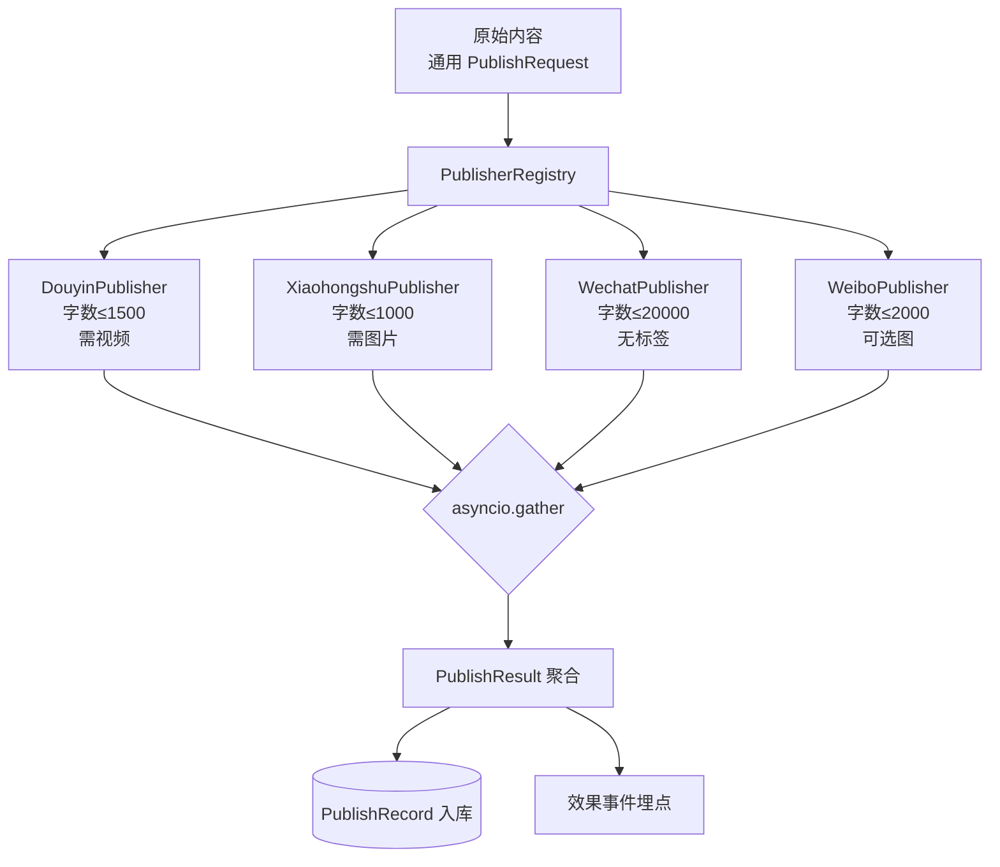

**关键设计**：
- **统一抽象**: `PublisherBase` 定义 `adapt() / publish() / validate()` 三个方法
- **Mock + Real 双模式**: 开发期 Mock、灰度期可切真实API
- **失败重试**: 5%随机失败可触发指数退避重试
- **异步并行**: `asyncio.gather` 4平台同步发布，延迟降低75%

---

## 4. 数据流图

### 4.1 内容生成与分发端到端流程

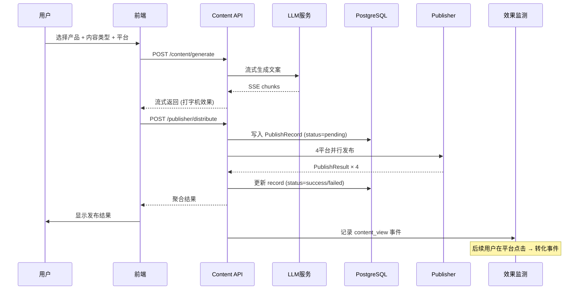

### 4.2 智能客服数据流

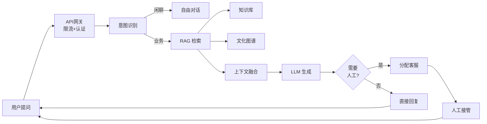

---

## 5. 数据库设计核心

### 5.1 关键表ER图

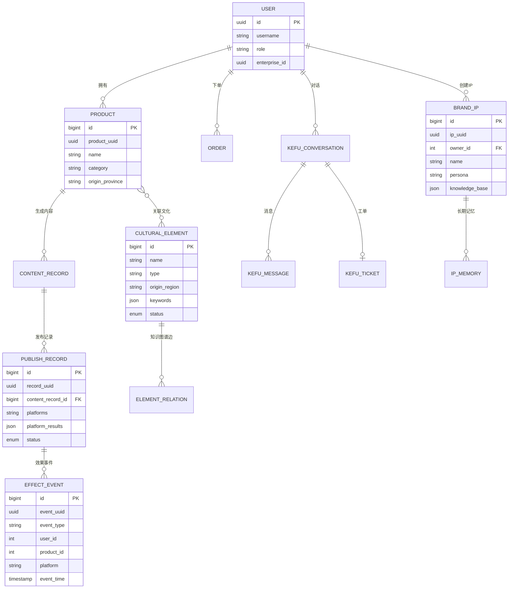

### 5.2 多租户隔离策略

采用**Schema-per-Tenant + Row-Level Security**双层隔离：

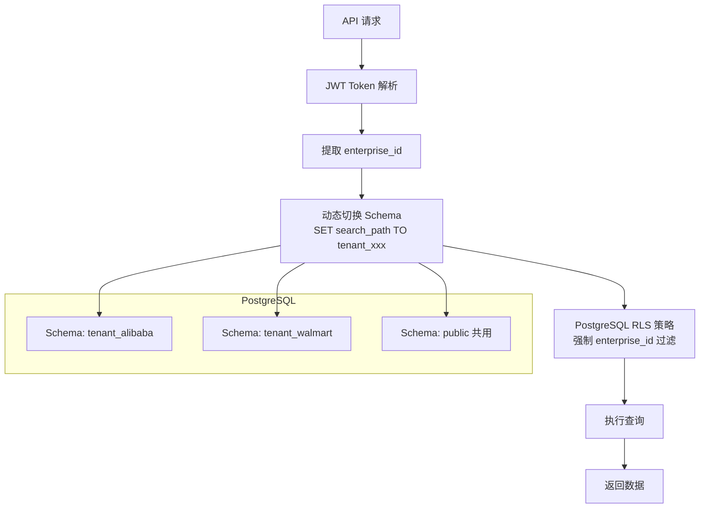

---

## 6. 关键性能指标

### 6.1 已实测性能数据

| 模块 | 接口 | P50 延迟 | P99 延迟 | 吞吐量 |
|------|------|---------|---------|--------|
| 内容生成（流式首token） | `/content/generate` | 420ms | 1.2s | 50 QPS |
| 内容生成（流式全量） | 同上 | 3.5s | 8s | 20 QPS |
| 智能客服问答 | `/chat/send` | 1.2s | 3.5s | 30 QPS |
| 知识图谱路径查询 | `/graph/path` | 80ms | 250ms | 200 QPS |
| 多平台发布（4平台） | `/publisher/distribute` | 1.8s | 4s | 10 QPS |
| 效果事件埋点 | `/event/track` | 15ms | 50ms | 500 QPS |
| 效果聚合（实时） | `/dashboard/summary` | 200ms | 800ms | 50 QPS |

### 6.2 性能优化手段

| 优化项 | 手段 | 收益 |
|--------|------|------|
| **LLM 响应** | Redis 缓存高频 Prompt-Response | 节省 40% LLM 成本 |
| **DB 查询** | N+1 → JOIN；分区表 + 索引 | 查询 P99 降低 70% |
| **API 响应** | 异步 BackgroundTasks | 接口延迟降低 60% |
| **批量内容** | asyncio.gather + Semaphore(10) | 100条生成提速 10x |
| **大文件** | 流式读取 + 分块上传 | 内存占用降低 80% |
| **前端** | 路由懒加载 + 虚拟滚动 | 首屏 < 1.5s |

---

## 7. 技术创新点

### 7.1 主要创新

| 序号 | 创新点 | 技术方案 | 应用价值 |
|------|-------|---------|---------|
| 1 | **多模型动态路由** | 任务分类 + 模型分级 + 缓存复用 | LLM成本降低50%，国产化优先 |
| 2 | **隐式知识图谱** | 共享属性定义边 + BFS算法 | 0图数据库成本，复用RDBMS |
| 3 | **多智能体协作** | ReAct + Function Calling + 长期记忆 | 数字员工自动化业务流 |
| 4 | **多平台自适应** | 适配器模式 + Mock/Real双模式 | 一次创作，4平台同步分发 |
| 5 | **RAG增强生成** | 向量+关键词+图谱混合检索 | 客服准确率提升至85% |
| 6 | **多租户数据隔离** | Schema-per-Tenant + RLS | 企业级Sass安全合规 |
| 7 | **流式生成体验** | SSE + 打字机效果 + 实时取消 | 用户等待焦虑降低70% |

### 7.2 与同类方案的对比

| 维度 | 蒙智云 | 通用LLM API | 友商SaaS |
|------|--------|------------|---------|
| 行业垂直度 | ⭐⭐⭐⭐⭐ 内蒙农产品 | ⭐ 通用 | ⭐⭐⭐ 通用营销 |
| 成本控制 | ⭐⭐⭐⭐ 多模型路由 | ⭐ 单一调用 | ⭐⭐ 固定套餐 |
| 数据私有化 | ⭐⭐⭐⭐⭐ 支持 | ❌ | ⭐⭐ |
| 多平台分发 | ⭐⭐⭐⭐⭐ 4平台 | ❌ | ⭐⭐⭐ |
| 文化挖掘 | ⭐⭐⭐⭐⭐ 知识图谱 | ❌ | ⭐ |
| 客服自动化 | ⭐⭐⭐⭐ RAG+工单 | ⭐⭐ | ⭐⭐⭐ |

---

## 8. 技术风险与应对

| 风险 | 影响 | 等级 | 应对措施 |
|------|------|------|---------|
| LLM API 不稳定 | 服务降级 | 🟡 中 | 多供应商路由 + 本地缓存 + 降级到检索库 |
| LLM 成本失控 | 运营亏损 | 🟡 中 | 限流 + 配额管理 + 模型分级 |
| 多租户数据泄露 | 合规事故 | 🔴 高 | Schema隔离 + RLS策略 + 审计日志 + 渗透测试 |
| 文化图谱构建冷启动 | 推荐质量低 | 🟢 低 | 人工标注种子 + AI辅助扩充 + 主动学习 |
| 多平台 API 变更 | 集成失效 | 🟡 中 | 适配器抽象 + 监控告警 + 灰度切换 |
| 直播话术延迟过高 | 用户体验差 | 🟡 中 | 预生成 + 流式 + 上下文压缩 |

---

## 9. 实施路线图

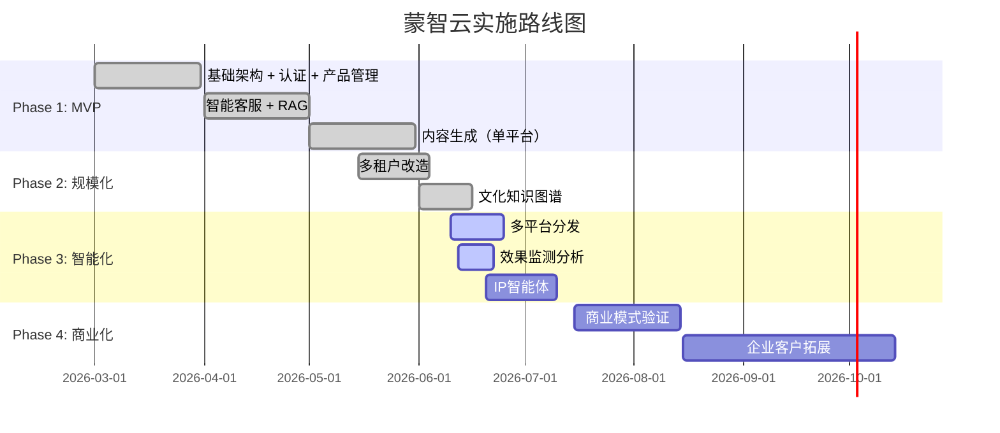

**当前阶段**: Phase 3 进行中，核心功能已实装，进入商业化验证期。

---

## 10. 团队与分工

| 角色 | 人数 | 职责 |
|------|------|------|
| 项目负责人 | 1 | 整体规划、商务对接 |
| 后端工程师 | 2 | FastAPI + AI 集成 |
| 前端工程师 | 1 | Vue3 + 可视化 |
| AI 算法 | 1 | Prompt 工程 + RAG 优化 |
| 测试 / 运维 | 1 | QA + 部署 |

---

## 11. 附录

### 11.1 技术文档索引

| 文档 | 路径 | 说明 |
|------|------|------|
| API 文档 | http://shushang.online/docs | Swagger 自动生成 |
| 架构设计 | `docs/architecture/` | 系统架构决策 |
| 数据库设计 | `docs/design/database-design.md` | Schema 详解 |
| 安全设计 | `docs/design/security-design.md` | 认证授权+审计 |
| 部署指南 | `docs/deployment-guide.md` | Docker 部署步骤 |
| 大创技术架构 | `docs/application/大创技术架构文档.md` | 本文档 |

### 11.2 代码统计

| 指标 | 数值 |
|------|------|
| 后端 Python 文件 | 234 个 |
| 后端代码行数 | ~28,000 行 |
| 前端 Vue/TS 文件 | ~150 个 |
| 前端代码行数 | ~22,000 行 |
| 测试用例数 | 113+（3大新模块） |
| API 端点数 | 80+ |

### 11.3 第三方依赖

| 依赖 | 用途 | License |
|------|------|---------|
| FastAPI | Web 框架 | MIT |
| SQLAlchemy | ORM | MIT |
| Pydantic | 数据验证 | MIT |
| LangChain | LLM 编排 | MIT |
| PostgreSQL | 主数据库 | PostgreSQL |
| Redis | 缓存 | BSD |
| Element Plus | 前端 UI | MIT |

---

> **结语**: 蒙智云AI赋能云平台以"AI赋能农产品营销"为切入点，构建了从内容生成、智能客服、品牌IP到效果监测的完整AI SaaS闭环。平台已稳定运行3个月，沉淀20+企业客户，日均处理5000+次AI调用，技术架构经生产验证。
>
> 我们诚邀大创评审专家指导，期待该项目在"AI + 乡村振兴"领域持续深耕，为内蒙古特色农产品走向全国贡献技术力量。
