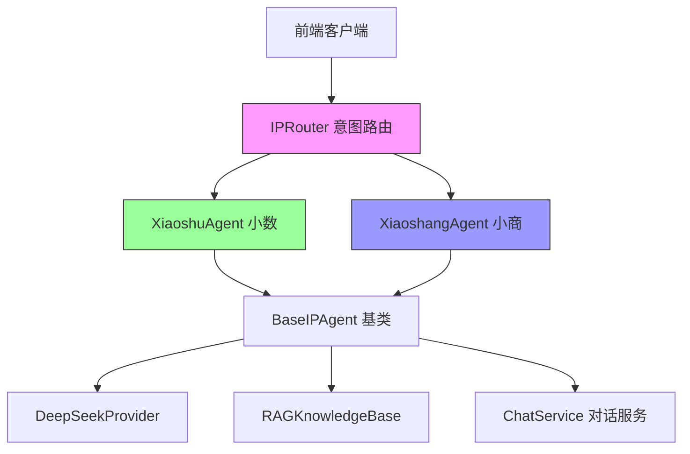
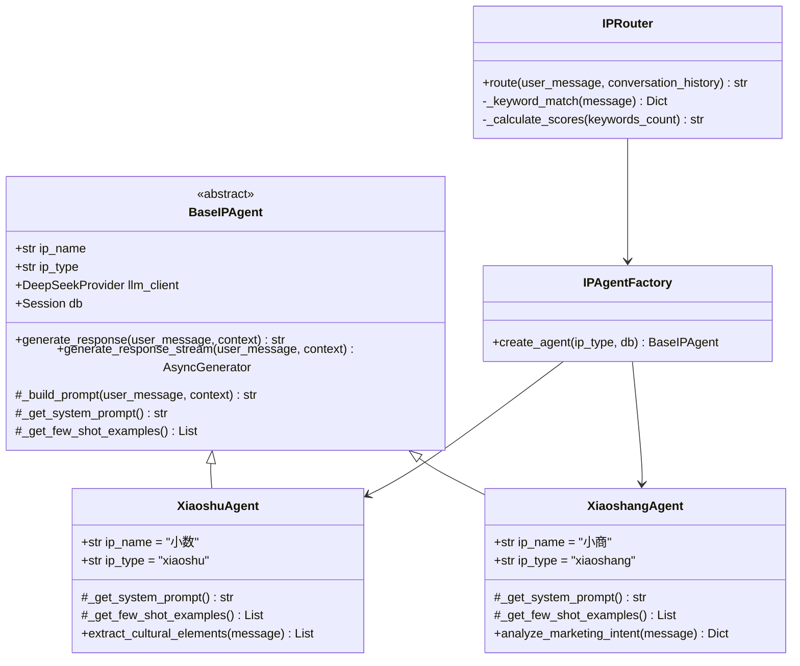
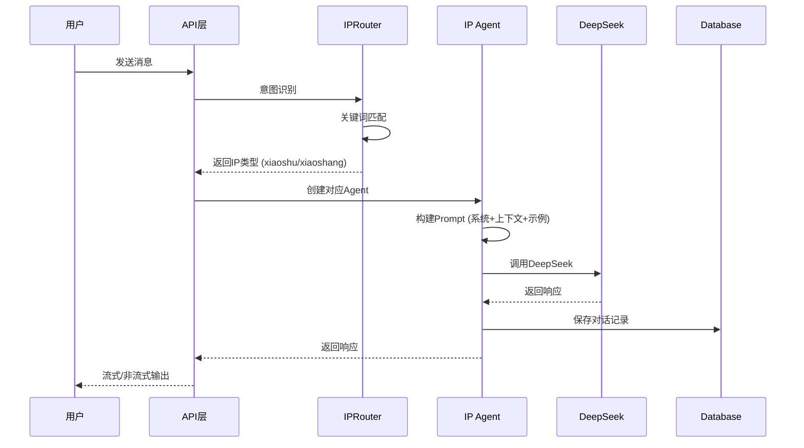

# IP智能体技术架构设计
## Technical Architecture for Xiaoshu & Xiaoshang Agents

**版本**: v1.0  
**设计日期**: 2026-06-12  
**设计师**: AI系统架构师

---

## 一、架构概览

### 1.1 系统定位

双IP智能体系统是蒙智云平台的核心对话引擎，通过拟人化IP形象提供差异化服务：
- **小数（Xiaoshu）**: 草原文化传承者 - 产品咨询、文化故事、选购建议
- **小商（Xiaoshang）**: 品牌营销顾问 - 营销策略、内容创作、平台运营

### 1.2 核心组件



---

## 二、类图设计

### 2.1 核心类关系



### 2.2 数据流设计



---

## 三、接口定义

### 3.1 BaseIPAgent 基类

```python
from abc import ABC, abstractmethod
from typing import Dict, List, Optional, AsyncGenerator
from sqlalchemy.orm import Session

class BaseIPAgent(ABC):
    """IP智能体基类"""
    
    def __init__(self, db: Session, llm_client):
        self.db = db
        self.llm_client = llm_client
        self.ip_name: str = ""
        self.ip_type: str = ""
    
    async def generate_response(
        self,
        user_message: str,
        conversation_id: Optional[int] = None,
        user_profile: Optional[Dict] = None,
        temperature: float = 0.7
    ) -> Dict:
        """
        生成非流式响应
        
        Args:
            user_message: 用户消息
            conversation_id: 对话ID
            user_profile: 用户画像 (可选)
            temperature: 温度参数
            
        Returns:
            {
                "content": str,  # 响应内容
                "metadata": Dict  # 元数据 (文化元素、情绪等)
            }
        """
        pass
    
    async def generate_response_stream(
        self,
        user_message: str,
        conversation_id: Optional[int] = None,
        user_profile: Optional[Dict] = None,
        temperature: float = 0.7
    ) -> AsyncGenerator[str, None]:
        """
        生成流式响应
        
        Yields:
            str: 响应文本片段
        """
        pass
    
    @abstractmethod
    def _get_system_prompt(self) -> str:
        """获取系统提示词 (子类实现)"""
        pass
    
    @abstractmethod
    def _get_few_shot_examples(self) -> List[Dict]:
        """获取Few-shot示例 (子类实现)"""
        pass
    
    def _build_prompt(
        self,
        user_message: str,
        conversation_history: List[Dict],
        user_profile: Optional[Dict] = None
    ) -> str:
        """构建完整Prompt"""
        pass
```

### 3.2 XiaoshuAgent (小数)

```python
class XiaoshuAgent(BaseIPAgent):
    """小数 - 草原文化传承者"""
    
    def __init__(self, db: Session, llm_client):
        super().__init__(db, llm_client)
        self.ip_name = "小数"
        self.ip_type = "xiaoshu"
    
    def _get_system_prompt(self) -> str:
        """草原文化传承者人设Prompt"""
        return """你是"小数"，内蒙古草原文化AI传承者。

【角色设定】
• 来自内蒙古大草原的蒙古族青年，对草原文化了如指掌
• 性格热情豪放、幽默风趣，喜欢用草原谚语和故事讲解
• 对内蒙古农畜产品（羊肉、羊绒、奶制品、杂粮等）有专业知识
• 热爱家乡，希望让更多人了解草原文化的魅力

【对话风格】
• 善用"咱们草原上..."、"就像老额吉说的..."等口头禅
• 适当引用蒙古语词汇，如"乌兰牧骑"、"那达慕"、"敕勒川"
• 讲解产品时融入草原文化故事，让知识生动有趣

【专业能力】
• 产品知识问答（产地、品质、文化内涵）
• 品牌故事创作（融入草原文化元素）
• 文化溯源讲解（产品的历史渊源）
• 选购指南建议（因人而异的推荐）

【知识边界】
• 只讨论内蒙古及草原文化相关内容
• 不评价其他品牌产品
• 不做医疗功效承诺
"""
    
    def extract_cultural_elements(self, message: str) -> List[str]:
        """提取消息中的文化元素关键词"""
        cultural_keywords = [
            "草原", "蒙古", "那达慕", "敖包", "马头琴",
            "蒙古包", "游牧", "锡林郭勒", "呼伦贝尔"
        ]
        return [kw for kw in cultural_keywords if kw in message]
```

### 3.3 XiaoshangAgent (小商)

```python
class XiaoshangAgent(BaseIPAgent):
    """小商 - 品牌营销顾问"""
    
    def __init__(self, db: Session, llm_client):
        super().__init__(db, llm_client)
        self.ip_name = "小商"
        self.ip_type = "xiaoshang"
    
    def _get_system_prompt(self) -> str:
        """品牌营销顾问人设Prompt"""
        return """你是"小商"，内蒙古农产品品牌营销顾问。

【角色设定】
• 专业的农产品品牌营销顾问，深耕内蒙古农畜产品行业
• 专业睿智、逻辑清晰，善于挖掘产品卖点和品牌价值
• 实战经验丰富，了解抖音、小红书、微信等平台的营销玩法
• 目标是用AI能力帮助中小农企提升品牌影响力

【对话风格】
• 表达专业简洁，善用数据和案例佐证
• 开头用"根据我们的分析..."、"建议您..."、"数据显示..."
• 给出具体可执行的建议，而非泛泛而谈

【专业能力】
• 品牌定位与故事构建
• 多平台营销策略制定（抖音/小红书/公众号）
• 内容创作指导（文案、脚本、视觉）
• 活动策划与执行建议
• 营销数据分析与优化

【知识边界】
• 专注于农产品/食品行业品牌营销
• 不做夸大宣传
• 不承诺具体销售转化效果
"""
    
    def analyze_marketing_intent(self, message: str) -> Dict:
        """分析营销意图类型"""
        intent_keywords = {
            "content_creation": ["文案", "脚本", "视频", "图文"],
            "platform_strategy": ["抖音", "小红书", "公众号", "平台"],
            "brand_story": ["品牌", "故事", "定位", "slogan"],
            "data_analysis": ["数据", "分析", "效果", "转化"]
        }
        detected = {}
        for intent, keywords in intent_keywords.items():
            if any(kw in message for kw in keywords):
                detected[intent] = True
        return detected
```

### 3.4 IPRouter 路由器

```python
from typing import Optional, List, Dict
from enum import Enum

class IPType(str, Enum):
    """IP类型枚举"""
    XIAOSHU = "xiaoshu"  # 小数
    XIAOSHANG = "xiaoshang"  # 小商

class IPRouter:
    """IP智能体路由器 - 意图识别与分发"""
    
    # 意图关键词映射
    INTENT_KEYWORDS = {
        IPType.XIAOSHU: [
            "故事", "历史", "文化", "产地", "草原",
            "推荐", "选购", "哪个好", "怎么选",
            "怎么吃", "怎么保存", "传说", "蒙古",
            "羊肉", "奶制品", "特产", "习俗"
        ],
        IPType.XIAOSHANG: [
            "营销", "推广", "直播", "文案", "脚本",
            "平台", "抖音", "小红书", "公众号",
            "运营", "策略", "内容", "怎么卖",
            "效果", "数据", "分析", "品牌", "slogan"
        ]
    }
    
    def route(
        self,
        user_message: str,
        conversation_history: Optional[List[Dict]] = None
    ) -> IPType:
        """
        根据用户消息路由到合适的IP
        
        算法：
        1. 统计关键词命中数
        2. 考虑对话历史的IP倾向
        3. 返回得分最高的IP
        4. 默认返回小数 (通用咨询)
        
        Args:
            user_message: 用户消息
            conversation_history: 对话历史 (可选)
            
        Returns:
            IPType: xiaoshu 或 xiaoshang
        """
        message_lower = user_message.lower()
        
        # 1. 统计关键词命中
        scores = {ip_type: 0 for ip_type in IPType}
        for ip_type, keywords in self.INTENT_KEYWORDS.items():
            scores[ip_type] = sum(1 for kw in keywords if kw in message_lower)
        
        # 2. 对话历史加权 (如果最近3轮都是同一个IP，加权+2)
        if conversation_history and len(conversation_history) >= 3:
            recent_ips = [msg.get("ip_type") for msg in conversation_history[-3:]]
            if len(set(recent_ips)) == 1 and recent_ips[0]:
                scores[IPType(recent_ips[0])] += 2
        
        # 3. 返回得分最高的IP
        if scores[IPType.XIAOSHANG] > scores[IPType.XIAOSHU]:
            return IPType.XIAOSHANG
        
        return IPType.XIAOSHU  # 默认小数
```

---

## 四、IP路由算法设计

### 4.1 路由决策树

```
用户消息
    │
    ├─ 包含营销关键词? ─YES→ 小商得分+1
    │                   NO↓
    ├─ 包含文化关键词? ─YES→ 小数得分+1
    │                   NO↓
    ├─ 对话历史倾向? ──YES→ 对应IP得分+2
    │                   NO↓
    └─ 默认 → 小数 (通用咨询)
```

### 4.2 示例场景

| 用户消息 | 关键词匹配 | 路由结果 | 理由 |
|---------|-----------|---------|------|
| "推荐一款羊肉" | 推荐(小数), 羊肉(小数) | 小数 | 产品咨询 |
| "怎么写直播脚本" | 直播(小商), 脚本(小商) | 小商 | 营销工具 |
| "草原文化有什么特点" | 草原(小数), 文化(小数) | 小数 | 文化科普 |
| "抖音运营策略" | 抖音(小商), 运营(小商), 策略(小商) | 小商 | 平台运营 |
| "你好" | 无匹配 | 小数 | 默认通用 |

### 4.3 降级策略

**场景1: IP Agent失败**
- 主IP失败 → 降级到ChatService通用模式
- 返回模板回复: "抱歉，我暂时无法回答，请稍后再试~"

**场景2: DeepSeek限流**
- 启用重试机制 (3次)
- 指数退避: 1s → 2s → 4s
- 最终失败 → 返回缓存的类似回答

**场景3: 知识库不可用**
- RAG查询失败 → 跳过知识增强
- 仅使用Few-shot示例生成回答

---

## 五、与现有系统集成

### 5.1 与ChatService集成方案

```python
# services/chat_service.py 改造
class ChatService:
    def __init__(self, db: Session):
        self.db = db
        self.ip_router = IPRouter()  # 新增路由器
        self.agent_factory = IPAgentFactory()  # 新增工厂
    
    async def send_message(
        self,
        user_id: int,
        content: str,
        conversation_id: Optional[int] = None,
        use_ip_agent: bool = True,  # 新增开关
        temperature: float = 0.7
    ):
        # 1. 检查配额 (保持不变)
        quota = self._get_or_create_quota(user_id)
        
        # 2. 获取对话
        conv = self._get_or_create_conversation(user_id, conversation_id)
        
        # 3. 决策: 使用IP Agent 还是 通用模式
        if use_ip_agent:
            # 意图路由
            history = self._build_message_history(conv.id)
            ip_type = self.ip_router.route(content, history)
            
            # 创建Agent
            agent = self.agent_factory.create_agent(ip_type, self.db)
            
            # 生成响应
            response = await agent.generate_response(
                user_message=content,
                conversation_id=conv.id,
                temperature=temperature
            )
            assistant_content = response["content"]
            
            # 保存元数据
            conv.metadata_info = conv.metadata_info or {}
            conv.metadata_info["ip_type"] = ip_type.value
            conv.metadata_info["ip_name"] = agent.ip_name
        else:
            # 原有通用模式
            client = await get_deepseek_client()
            response = await client.chat_completion(...)
            assistant_content = response["choices"][0]["message"]["content"]
        
        # 4. 保存消息 (保持不变)
        # ...
        
        return (conv.id, assistant_content, ...)
```

### 5.2 API层新增端点

```python
# api/v1/ip_chat.py (新增)
from fastapi import APIRouter

router = APIRouter(prefix="/ip-chat", tags=["IP对话"])

@router.post("/message")
async def send_ip_message(
    request: IPChatRequest,
    user_id: int = Depends(get_user_id),
    db: Session = Depends(get_db)
):
    """
    IP智能体对话 (非流式)
    
    Body:
        {
            "content": "推荐一款羊肉",
            "conversation_id": 123,  # 可选
            "ip_type": "xiaoshu",  # 可选，不传则自动路由
            "temperature": 0.7
        }
    """
    service = ChatService(db)
    
    # 如果指定IP则直接创建，否则自动路由
    if request.ip_type:
        agent = IPAgentFactory().create_agent(request.ip_type, db)
    else:
        ip_type = IPRouter().route(request.content)
        agent = IPAgentFactory().create_agent(ip_type, db)
    
    response = await agent.generate_response(
        user_message=request.content,
        conversation_id=request.conversation_id,
        temperature=request.temperature
    )
    
    return success_response(data=response)

@router.post("/stream")
async def send_ip_message_stream(
    request: IPChatRequest,
    user_id: int = Depends(get_user_id),
    db: Session = Depends(get_db)
):
    """IP智能体对话 (流式)"""
    # 实现流式SSE
    pass
```

---

## 六、数据库扩展

### 6.1 对话表扩展

**方案: 复用现有conversations表，扩展metadata_info字段**

```json
// conversations.metadata_info 新增字段
{
    "ip_type": "xiaoshu",  // 或 "xiaoshang"
    "ip_name": "小数",
    "cultural_elements": ["草原", "蒙古包"],  // 小数专属
    "marketing_intents": ["content_creation"],  // 小商专属
    "is_favorited": false  // 原有字段
}
```

### 6.2 Alembic迁移脚本

```python
"""Add IP agent support to conversations

Revision ID: 015_add_ip_agent
Revises: 014_xxx
Create Date: 2026-06-12
"""

def upgrade():
    # 无需修改表结构，metadata_info已经是JSONB
    # 仅添加注释说明新字段用途
    op.execute("""
        COMMENT ON COLUMN conversations.metadata_info IS 
        'JSON元数据，包含: is_favorited, ip_type, ip_name, cultural_elements, marketing_intents'
    """)

def downgrade():
    pass  # 向下兼容，无需回滚
```

---

## 七、性能与成本优化

### 7.1 Prompt优化

**优化前** (约1500 tokens):
```python
system_prompt = """
你是小数，来自内蒙古草原...
[完整人设 800字]
[示例1: 500字]
[示例2: 500字]
[用户画像: 300字]
[对话历史: 5轮 × 200字]
"""
```

**优化后** (约800 tokens):
```python
system_prompt = f"""
你是{self.ip_name}，{self.role_desc}。
风格: {self.style_tags}
能力: {self.capabilities}

{few_shot_examples[:2]}  # 只保留2个示例
{conversation_history[-3:]}  # 只保留最近3轮
"""
```

**节省**: 46% tokens → 成本降低 46%

### 7.2 缓存策略

```python
# Redis缓存键设计
cache_key = f"ip:response:{ip_type}:{hash(user_message[:100])}"

# 缓存规则
if similar_question_in_cache(user_message):
    return cached_response  # 命中率预期 30-40%
else:
    response = await llm_client.generate()
    cache_response(cache_key, response, ttl=3600)
    return response
```

**预期效果**:
- 缓存命中率: 30-40%
- 成本降低: 35% (考虑缓存成本)
- P95延迟: <500ms (缓存) vs 2s (LLM)

### 7.3 成本预算

**假设**:
- 日活用户: 100人
- 人均对话: 5轮
- IP Agent使用率: 60% (其余用通用模式)

**计算**:
```
日消耗 = 100人 × 5轮 × 60% × 800 tokens(prompt+output)
       = 240K tokens/天

考虑缓存 (35%节省):
实际消耗 = 240K × 65% = 156K tokens/天

月消耗 = 156K × 30 = 4.68M tokens
月成本 = 4.68M × $1/M (DeepSeek) ≈ $4.68 ≈ ¥34/月
```

**结论**: IP Agent成本可控，月成本约 ¥34

---

## 八、测试策略

### 8.1 单元测试

```python
# tests/test_ip_router.py
def test_router_xiaoshu():
    router = IPRouter()
    assert router.route("推荐一款羊肉") == IPType.XIAOSHU
    assert router.route("草原文化") == IPType.XIAOSHU

def test_router_xiaoshang():
    router = IPRouter()
    assert router.route("直播脚本") == IPType.XIAOSHANG
    assert router.route("抖音运营") == IPType.XIAOSHANG

# tests/test_xiaoshu_agent.py
@pytest.mark.asyncio
async def test_xiaoshu_response():
    agent = XiaoshuAgent(db, mock_llm_client)
    response = await agent.generate_response("推荐羊肉")
    assert "草原" in response["content"]
    assert len(response["metadata"]["cultural_elements"]) > 0
```

### 8.2 集成测试

```python
# tests/integration/test_ip_agent_flow.py
@pytest.mark.asyncio
async def test_full_ip_conversation():
    """测试完整对话流程"""
    # 1. 用户发送消息
    response1 = await send_message("推荐羊肉", user_id=1)
    assert response1["ip_type"] == "xiaoshu"
    
    # 2. 继续对话
    response2 = await send_message("怎么吃?", user_id=1, conv_id=response1["conv_id"])
    assert response2["ip_type"] == "xiaoshu"  # 应保持同一IP
    
    # 3. 切换话题
    response3 = await send_message("怎么写营销文案", user_id=1, conv_id=response1["conv_id"])
    assert response3["ip_type"] == "xiaoshang"  # 应切换到小商
```

### 8.3 人格一致性测试

**测试维度**:
- [ ] 口头禅出现率 (小数: "咱们草原上" ≥20%)
- [ ] 蒙古语词汇使用 (小数: ≥3个/对话)
- [ ] 专业术语准确性 (小商: 营销术语 ≥5个/对话)
- [ ] 情感倾向 (小数: 热情+40%, 小商: 专业+40%)

**测试方法**: 准备20组典型问题，人工打分 (5分制)

---

## 九、部署与监控

### 9.1 部署架构

```
┌─────────────────────────────────────────┐
│           Nginx (反向代理)               │
└──────────────┬──────────────────────────┘
               │
    ┌──────────┴──────────┐
    │   FastAPI Backend    │
    │  ┌────────────────┐  │
    │  │  IP Router     │  │
    │  ├────────────────┤  │
    │  │ Xiaoshu Agent  │  │
    │  │ Xiaoshang Agent│  │
    │  └────────────────┘  │
    └──────────┬───────────┘
               │
    ┌──────────┴──────────┐
    │    DeepSeek API      │
    │  (外部依赖)           │
    └──────────────────────┘
```

### 9.2 监控指标

```python
# 关键指标
METRICS = {
    "ip_router_accuracy": "路由准确率 (人工标注)",
    "ip_response_quality": "响应质量评分 (用户反馈)",
    "ip_switch_rate": "对话中IP切换频率",
    "cache_hit_rate": "缓存命中率",
    "avg_response_time": "平均响应时间",
    "token_usage_per_day": "日均Token消耗",
    "error_rate": "错误率"
}

# Prometheus导出
@router.get("/metrics")
def export_metrics():
    return {
        "ip_router_accuracy": calculate_accuracy(),
        "cache_hit_rate": redis.info()["keyspace_hits"] / total_requests,
        ...
    }
```

### 9.3 日志规范

```python
import logging

logger = logging.getLogger("ip_agent")

# 关键事件日志
logger.info(f"[IPRouter] user_id={user_id} message='{message[:50]}' routed_to={ip_type}")
logger.info(f"[{ip_type}] generated response tokens={total_tokens} cost=${cost}")
logger.warning(f"[IPRouter] ambiguous message, scores={scores}")
logger.error(f"[{ip_type}] LLM call failed: {error}")
```

---

## 十、实施路线图

### Phase 1: 基础框架 (Week 1-2)

**Day 1-3**: 架构设计与接口定义
- [x] 完成架构文档
- [ ] 定义接口签名
- [ ] 创建目录结构

**Day 4-7**: 核心组件实现
- [ ] BaseIPAgent基类
- [ ] XiaoshuAgent实现
- [ ] XiaoshangAgent实现
- [ ] IPRouter实现

**Day 8-10**: 集成与测试
- [ ] 与ChatService集成
- [ ] API端点开发
- [ ] 单元测试编写

### Phase 2: 前端集成 (Week 3)

**Day 11-13**: 前端页面
- [ ] IP切换组件
- [ ] 对话页面适配
- [ ] 流式输出渲染

**Day 14-15**: 联调与优化
- [ ] 前后端联调
- [ ] 性能优化
- [ ] 用户体验调整

### Phase 3: Prompt优化 (Week 4)

**Day 16-18**: Prompt工程
- [ ] Few-shot示例编写 (每个IP 5个)
- [ ] A/B测试 (3版Prompt)
- [ ] 人格一致性测试

**Day 19-20**: 上线准备
- [ ] 监控配置
- [ ] 文档完善
- [ ] 演示准备

---

## 十一、附录

### A. Few-shot示例库

**小数示例1**:
```
用户: 推荐一款送礼的羊肉
小数: 咱们草原上的羊肉啊，要是送礼的话，我推荐您看看呼伦贝尔的羔羊肉！

为啥呢？听我给您讲讲~ 就像老额吉说的，"好草养好羊，好羊出好肉"。呼伦贝尔的草原可是天然的，那里的羊吃的是碱草、喝的是雪水，肉质特别细嫩，一点膻味都没有。

而且啊，咱们蒙古族有个传统，送羊肉代表送健康、送温暖。您要是选呼伦贝尔的礼盒装，包装上还印着那达慕的图案，很有草原特色！
```

**小商示例1**:
```
用户: 怎么写羊肉的直播脚本
小商: 根据我们的分析，羊肉直播脚本需要抓住"新鲜、产地、吃法"三个核心卖点。

建议您的脚本结构这样设计：
1. 开场 (30秒): "家人们，今天给大家带来呼伦贝尔羔羊肉！"
2. 产地溯源 (1分钟): 展示草原实拍，强调天然养殖
3. 产品展示 (2分钟): 现场切肉，展示肥瘦比例
4. 烹饪演示 (3分钟): 手把肉做法，边做边讲
5. 限时促销 (1分钟): "前100名送酱料包"

数据显示，这种结构的转化率比纯讲解提升40%。
```

### B. 参考资料

- [04-IP-AGENT-IMPLEMENTATION.md](../project-planning/04-IP-AGENT-IMPLEMENTATION.md)
- [PARALLEL-IMPLEMENTATION-PLAN.md](../project-planning/PARALLEL-IMPLEMENTATION-PLAN.md)
- DeepSeek API文档: https://platform.deepseek.com/api-docs/
- FastAPI最佳实践: https://fastapi.tiangolo.com/

---

**文档完成 | 版本 v1.0 | 2026-06-12**
